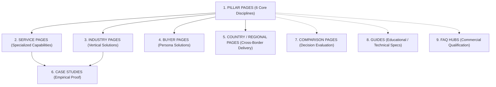

# XIYÀTO — International Search-Intent & Commercial Opportunity Matrix

**Website**: [https://xiyato.uk](https://xiyato.uk)  
**Target Markets**: United Kingdom, United States, UAE, Saudi Arabia, Qatar, Australia, Canada, Singapore, Germany, Netherlands, Switzerland, France, Ireland.  
**Core Disciplines**:
1. CAD & Technical Production (`/services/cad-technical-production`)
2. B2B Growth, Research & Lead Generation (`/services/growth-marketing-b2b`)
3. 3D Visualisation & Image Production (`/services/visualisation-image-production`)
4. Video, AI Film & Editing (`/services/video-ai-film-editing`)
5. Website Design & Development (`/services/website-design-development`)
6. Automation & Marketing Systems (`/services/automation-workflow-systems`)

---

## 1. Strategic Principles & Commercial Intent Scoring

### Priority Over Volume
Raw search volume is a vanity metric in high-ticket B2B service delivery. A search query with 50 monthly searches made by senior architectural partners, commercial procurement directors, or luxury brand founders looking to contract an external production partner has a 100x higher economic yield than an informational query with 10,000 monthly searches made by students or hobbyists (e.g., *"free CAD blocks"* vs. *"outsourced CAD drafting services for interior design firms"*).

### Strict Anti-Doorway & Quality Standard
- **No Programmatic City/Country Clones**: We never generate duplicate pages with swapped city names (e.g., `/cad-drafting-london`, `/cad-drafting-manchester`, `/cad-drafting-dubai` sharing identical copy).
- **Material Distinction Hurdle**: A new URL is created if and only if the search intent, technical regulatory requirements, procurement workflow, or buyer persona is materially distinct.
- **Proof-Backed Execution**: Every proposed ranking asset is paired with verified XIYÀTO proprietary evidence (Bahrain luxury CAD package, Middle East lead intelligence workbooks, Sultanah Moon Chair cinematic film, or Next.js performance benchmarks).

---

## 2. Master Opportunity Matrix by Discipline & Country

Below is the comprehensive matrix of high-intent commercial opportunities across the 13 priority territories. Every opportunity is documented with all 15 required strategic parameters.

```
LEGEND:
- Stage: PR (Problem Recognition) | SE (Solution Evaluation) | VS (Vendor Selection) | AP (Active Procurement)
- Comp: L (Low) | M (Medium) | H (High)
- Decision: IMP (Improve Existing Page) | NEW (Create Distinct Page)
- Priority: P0 (Immediate / High Leverage) | P1 (High Priority) | P2 (Subsequent Expansion)
```

---

### A. CAD & Technical Production (`CAD`)

| # | Query | Country | Service | Search Intent | Buyer Type | Stage | Est. Commercial Value | Comp | Current Ranking Competitors | Type of Page Google Rewards | Existing Page Candidate | Decision | Proof Available | Recommended CTA | Pri |
|:---:|---|:---:|:---:|---|---|:---:|:---:|:---:|---|---|---|:---:|---|---|:---:|
| **01** | `outsourced cad drafting services uk` | UK | CAD | Commercial / Vendor Selection | Managing Director / Lead Architect, UK Interior Practice | VS | £15,000–£75,000 /yr retainer | M | OutsourceCAD, BackOffice Pro, CAD Drafting Team UK | Technical service pillar with layer standards, turnaround SLAs, and drawing sheet downloads | `/services/cad-technical-production` | IMP | Bahrain 20-sheet Luxury Drawing Package, AIA/ISO layer compliance | Direct WhatsApp Brief / Request CAD Scope Review | **P0** |
| **02** | `interior fit out shop drawing services` | UAE / Saudi | CAD | Active Procurement / Vendor Selection | Commercial Fit-Out Contractor / Hotel Project Director | AP | £25,000–£120,000 /project | M | Innodez Middle East, Silicon Valley UAE, CAD Outsourcing Dubai | Commercial service page showcasing joinery details, MEP coordination, and site submittal compliance | `/services/cad-technical-production` | NEW (`/services/cad/interior-fit-out-shop-drawings`) | Bahrain custom millwork, sanitary elevations, tile-setting layouts | Submit Fit-Out DWG Drawings for Turnaround Quote | **P0** |
| **03** | `architectural drawing production overflow` | UK / US | CAD | Problem-Aware / Solution Evaluation | Studio Principal / Operations Director, Architecture Firm | SE | £20,000–£80,000 /yr | L | MicroStudio, Freelance platforms, ArcDesign | Practical guide and capability overview solving capacity crunches during tender deadlines | `/services/cad-technical-production` | NEW (`/services/cad/overflow-capacity-support`) | 4-day delivery turnarounds, Redline-to-CAD revision protocols | WhatsApp Production Director / Schedule Capacity Call | **P0** |
| **04** | `joinery detailing services for interior designers` | UK / Ireland | CAD | Commercial Investigation | Bespoke Joinery Specialist / High-End Residential Designer | VS | £10,000–£40,000 /project | L | Specialist UK joinery drafting agencies, Cadline | Deep technical page with section details, hardware schedules, and material callouts | `/services/cad-technical-production` | NEW (`/services/cad/bespoke-joinery-millwork-detailing`) | Bahrain master dressing room, vanity details, concealed hinge callouts | Request Sample Joinery PDF / Direct WhatsApp | **P1** |
| **05** | `commercial cad drafting services usa` | US | CAD | Vendor Selection | General Contractor / Architectural Project Manager | VS | $30,000–$150,000 /yr | H | CADDesignGroup, CAD-Outsourcing, BackOffice Pro | Comprehensive capability page detailing US National CAD Standard (NCS) compliance | `/services/cad-technical-production` | IMP | Full NCS-compliant drawing sets, vector PDF exports | Schedule US Timezone Brief / WhatsApp | **P1** |
| **06** | `cad drafting services qatar` | Qatar | CAD | Active Procurement | Hotel Fit-out Contractor / Lusail/Doha Project Manager | AP | £20,000–£90,000 /project | M | Middle East CAD hubs, Gulf Infotech | Regional service page highlighting GCC luxury hospitality and fast turnaround submittals | `/services/cad-technical-production` | NEW (`/services/cad/middle-east-fitout-drafting`) | GCC villa drawing packages, millwork coordination sheets | Request GCC Tender Drawing Review via WhatsApp | **P1** |
| **07** | `bim to cad conversion and 2d detailing` | Canada / Australia | CAD | Technical / Solution Evaluation | BIM Manager / Engineering Consultancy Lead | SE | $15,000–$50,000 | M | BIM outsourcing firms, Pinnacle Infotech | Workflow-driven page explaining Revit/IFC to clean 2D DWG extraction | `/services/cad-technical-production` | NEW (`/services/cad/bim-coordination-detailing`) | Layer-disciplined DWG outputs, clean block definitions | Send Model for Extraction Quote | **P2** |
| **08** | `reflected ceiling plan lighting coordination drawings` | UK / Australia | CAD | Solution Evaluation | Lighting Designer / MEP Fit-Out Coordinator | SE | £8,000–£25,000 | L | Specialized MEP CAD portals, Lighting design studios | Technical guide with sample RCP coordination overlays | `/services/cad-technical-production` | NEW (`/services/cad/reflected-ceiling-plan-coordination`) | Bahrain luxury multi-circuit RCP drawing sheets | Download Sample RCP Package | **P2** |
| **09** | `cad outsourcing vs in house drafting cost` | UK / US | CAD | Problem Recognition / Comparison | Practice Finance Director / Architecture Studio Owner | PR | £30,000–£100,000+ saved/yr | M | Archisoup, Monograph, Outsourcing blogs | Comprehensive economic comparison guide with salary, software, and overhead breakdown | `/services/cad-technical-production` | NEW (`/guides/cad-outsourcing-vs-in-house-cost-analysis`) | Transparent sheet-based vs monthly retainer economics | Calculate Your Studio Drafting Savings | **P1** |
| **10** | `mep coordination drawing production for luxury residences` | UAE / Switzerland | CAD | Vendor Selection | Luxury MEP Contractor / Private Villa Project Manager | VS | £20,000–£60,000 | L | High-end MEP drafting bureaus | Highly specialized technical page demonstrating duct/pipe/chilled ceiling integration | `/services/cad-technical-production` | NEW (`/services/cad/luxury-residential-mep-coordination`) | Bahrain penthouse MEP coordination and concealed service drawings | Direct WhatsApp Technical Review | **P2** |

---

### B. B2B Growth, Research & Lead Generation (`Growth`)

| # | Query | Country | Service | Search Intent | Buyer Type | Stage | Est. Commercial Value | Comp | Current Ranking Competitors | Type of Page Google Rewards | Existing Page Candidate | Decision | Proof Available | Recommended CTA | Pri |
|:---:|---|:---:|:---:|---|---|:---:|:---:|:---:|---|---|---|:---:|---|---|:---:|
| **11** | `middle east b2b market research services` | UK / US / Germany | Growth | Commercial Investigation | VP International Business / Export Sales Director | SE | £20,000–£90,000 /engagement | M | Frost & Sullivan Middle East, Ken Research, Euromonitor | Data-led service page detailing industry coverage, methodology, and verified contacts | `/services/growth-marketing-b2b` | NEW (`/services/growth/middle-east-market-intelligence`) | 7 Proprietary Research Workbooks (GCC Fit-Out, UAE Contractors) | Request Middle East Sample Research / WhatsApp | **P0** |
| **12** | `luxury interior design decision maker data` | UK / US / Italy | Growth | Active Procurement | High-End FF&E Manufacturer / Marble/Textile Supplier | AP | £8,000–£35,000 /list | L | Apollo custom search, Niche B2B data providers | Specialized audience page showing exact data schemas, job titles, and verification rate | `/work/research/gcc-interior-design-decision-makers` | IMP | 1,200+ verified GCC & European interior principals, phone/email data | Inspect Sample Data Sheet / Request Custom Spec | **P0** |
| **13** | `b2b lead generation for architecture and design studios` | UK / US | Growth | Solution Evaluation | Architecture Studio Founder / Growth Partner | SE | £12,000–£48,000 /yr | M | Archibiz, Specialized agency growth consultants | Case-study driven service page illustrating developer and HNW client pipeline creation | `/services/growth-marketing-b2b` | NEW (`/services/growth/lead-generation-architecture-studios`) | Live prospect intelligence lists, verified enterprise routing | Book B2B Pipeline Strategy Session | **P0** |
| **14** | `commercial fit out contractor prospect database gcc` | UAE / Saudi | Growth | Active Procurement | Building Materials Supplier / MEP Subcontractor | AP | £15,000–£50,000 | L | BNC Network, Ventures ONSITE, MEED | Direct data product page with downloadable redacted spreadsheet and data dictionary | `/work/research/gcc-interior-design-decision-makers` | NEW (`/work/research/gcc-commercial-contractors-database`) | 850+ verified GCC main and fit-out contractor executive rows | Download Sample Excel / Order Custom Extract | **P1** |
| **15** | `outsourced b2b prospect research services uk` | UK / Ireland | Growth | Vendor Selection | Head of Business Development / Sales Operations Director | VS | £15,000–£60,000 /yr | M | Cognism, Pearl Lemon Leads, SalesLeap | In-depth methodology page demonstrating human-verified data vs automated scrapers | `/services/growth-marketing-b2b` | IMP | Zero-bounce guarantee methodology, multi-channel verification | Request Pilot Prospect Research Batch | **P1** |
| **16** | `european furniture manufacturer buyers list` | Germany / Netherlands / UK | Growth | Active Procurement | Global Textile / Foam / Hardware Supplier | AP | £10,000–£30,000 | L | Industry directories, Kompass | Detailed sector intelligence page with procurement head profiles | `/services/growth-marketing-b2b` | NEW (`/work/research/european-furniture-manufacturers-intelligence`) | China & European Furniture Supplier Workbook | Request Industry Data Preview | **P2** |
| **17** | `how to find hospitality procurement managers middle east` | UK / US / France | Growth | Informational / Problem Recognition | Luxury Lighting / Amenities Export Director | PR | £15,000–£50,000 | L | Trade blogs, Middle East Hotel Network | Tactical authority guide breaking down procurement cycles, hotel operator specs, and data sourcing | `/services/growth-marketing-b2b` | NEW (`/guides/procuring-hospitality-contracts-middle-east`) | GCC Hotel Operator & Specifier database breakdown | Download Full Guide & Specifier Sample | **P1** |
| **18** | `b2b lead research singapore tech and design` | Singapore / Australia | Growth | Commercial Investigation | Regional MD / APAC Sales Director | SE | $12,000–$40,000 | L | Regional APAC lead agencies, Sleek | APAC-focused B2B research capability page | `/services/growth-marketing-b2b` | NEW (`/services/growth/apac-b2b-lead-intelligence`) | APAC commercial enterprise research frameworks | Inquire for APAC Data Pipeline | **P2** |

---

### C. 3D Visualisation & Image Production (`3D Viz`)

| # | Query | Country | Service | Search Intent | Buyer Type | Stage | Est. Commercial Value | Comp | Current Ranking Competitors | Type of Page Google Rewards | Existing Page Candidate | Decision | Proof Available | Recommended CTA | Pri |
|:---:|---|:---:|:---:|---|---|:---:|:---:|:---:|---|---|---|:---:|---|---|:---:|
| **19** | `luxury interior 3d rendering studio uk` | UK | 3D Viz | Vendor Selection | High-End Interior Designer / Prime London Residential Developer | VS | £12,000–£50,000 /project | H | The Boundary, Blackhaus, XO3D, Render Atelier | High-resolution portfolio gallery with lighting studies, material closeups, and turnaround times | `/services/visualisation-image-production` | IMP | Bahrain Master Suite Renders, bespoke marble & timber texturing | Request 3D Visualisation Proposal / WhatsApp | **P0** |
| **20** | `architectural visualisation studio middle east` | UAE / Saudi / Qatar | 3D Viz | Active Procurement | Real Estate Master Developer / Lead Design Architect | AP | £30,000–£150,000 /project | M | Mirage Visuals, Render Atelier Dubai, Pixel3D | Project showcase page focusing on mega-developments, luxury hospitality, and competition renders | `/services/visualisation-image-production` | NEW (`/services/visualisation/middle-east-architectural-cgi`) | Gulf luxury residence exterior and interior visuals, realistic day/night lighting | Submit Architectural CAD/Model for 3D CGI Quote | **P0** |
| **21** | `photorealistic furniture rendering services` | US / UK / Germany | 3D Viz | Commercial Investigation | Luxury Furniture Brand Director / Industrial Designer | SE | £8,000–£35,000 /collection | M | Sayduck, Cylindo, RealSpace, CGIFurniture | Studio craft page showing fabric weave, wood grain, stitching detail, and studio lighting | `/services/visualisation-image-production` | NEW (`/services/visualisation/photorealistic-furniture-rendering`) | Sultanah Moon Chair 3D visuals, leather stitching & curved veneer studies | Send 3D CAD/Dimensions for Lighting Test | **P0** |
| **22** | `unbuilt property marketing renders london` | UK | 3D Viz | Commercial Investigation | Property Development Marketing Director / Estate Agent | SE | £15,000–£60,000 /scheme | M | DBOX London, Our Place, Uniform | High-end editorial showcase demonstrating planning approval and pre-sales CGI | `/services/visualisation-image-production` | NEW (`/services/visualisation/unbuilt-property-marketing-cgi`) | Luxury residential interior/exterior schemes, photorealistic staging | Request Development CGI Quotation | **P1** |
| **23** | `cgi rendering for hotel and resort developments` | UAE / Switzerland / France | 3D Viz | Vendor Selection | Hospitality Asset Manager / Hotel Brand Design Director | VS | £25,000–£100,000 | M | Luxury hospitality CGI agencies | Case-study page demonstrating atmospheric storytelling, pool/spa render accuracy, and FF&E fidelity | `/services/visualisation-image-production` | NEW (`/services/visualisation/hospitality-resort-cgi`) | High-end hospitality suites, bespoke joinery rendering | Discuss Hospitality CGI Scope via WhatsApp | **P1** |
| **24** | `commercial exterior architectural rendering usa` | US / Canada | 3D Viz | Active Procurement | Commercial Developer / Corporate Architecture Principal | AP | $20,000–$80,000 | H | Studio AMD, Visualhouse, Render3DQuick | Portfolio page with architectural lighting, landscape realism, and building envelope details | `/services/visualisation-image-production` | IMP | Photorealistic facade renders, day/dusk lighting transitions | Submit Plans for American Turnaround Quote | **P1** |
| **25** | `3d architectural rendering pricing guide uk` | UK / Ireland | 3D Viz | Problem Recognition / Commercial Research | Interior Architect / Quantity Surveyor | PR | £10,000–£40,000 | M | Render3D, Archisoup, UK CGI blogs | Transparent pricing benchmark guide by room, exterior, resolution, and revision cycles | `/services/visualisation-image-production` | NEW (`/guides/architectural-rendering-pricing-guide-uk`) | Fixed-fee transparent tier matrix (£500–£2,500/view) | View Complete 3D Visualisation Rate Card | **P1** |

---

### D. Video, AI Film & Editing (`Video`)

| # | Query | Country | Service | Search Intent | Buyer Type | Stage | Est. Commercial Value | Comp | Current Ranking Competitors | Type of Page Google Rewards | Existing Page Candidate | Decision | Proof Available | Recommended CTA | Pri |
|:---:|---|:---:|:---:|---|---|:---:|:---:|:---:|---|---|---|:---:|---|---|:---:|
| **26** | `luxury furniture brand commercial video production` | UK / US / France | Video | Vendor Selection | Head of Marketing, Luxury Furniture Atelier | VS | £15,000–£50,000 /campaign | L | Boutique luxury commercial agencies, Film production houses | Cinematic portfolio page showing 4K footage, macro texture details, and multi-ratio delivery | `/services/video-ai-film-editing` | NEW (`/services/video/luxury-furniture-brand-films`) | Sultanah Moon Chair Cinematic Film (4K, soundscape, 9:16 cuts) | Watch Sultanah Campaign / Request Treatment | **P0** |
| **27** | `cinematic architectural video production uk` | UK | Video | Commercial Investigation | Real Estate Developer / High-End Estate Agency Partner | SE | £12,000–£45,000 /project | M | Squint/Opera, Crown Creative, StoryTerrace | Showreel-driven page highlighting lighting, pacing, drone integration, and narrative pacing | `/services/video-ai-film-editing` | IMP | 4K architectural visual reels, atmospheric sound engineering | View Cinematic Showreel / Book Video Brief | **P0** |
| **28** | `ai commercial video production agency` | US / UK / UAE | Video | Solution Evaluation / Emerging Procurement | Creative Director / Brand CMO | SE | £20,000–£75,000 /project | M | Seyhan, Waymark, Boutique AI production studios | Production breakdown showing hybrid live-action, 3D CGI, and AI generative enhancement | `/services/video-ai-film-editing` | IMP | Sultanah Moon Chair AI atmospheric enhancement, sound design | Request AI Film Proof of Concept | **P1** |
| **29** | `architectural walk through video cost uk` | UK / Australia | Video | Problem Recognition / Commercial Research | Property Developer / Architecture Studio Partner | PR | £10,000–£35,000 | L | UK production blogs, CGI studios | Cost breakdown guide detailing seconds/runtime, render farm costs, and live-action integration | `/services/video-ai-film-editing` | NEW (`/guides/architectural-walkthrough-video-production-cost`) | Transparent project tiering (£2,500–£15,000) | Download Production Budget Guide | **P1** |
| **30** | `social media video editing for design studios` | UK / US / Canada | Video | Vendor Selection | Social Media Director, Luxury Architecture or Lifestyle Brand | VS | £3,000–£12,000 /mo | M | Vidchops, BeCreatives, freelance collectives | Portfolio page showing 9:16 vertical cuts, retention metrics, and editorial rhythm | `/services/video-ai-film-editing` | NEW (`/services/video/social-video-editorial-design-brands`) | Multi-ratio cuts of Sultanah campaign and interior animations | Inquire for Monthly Video Retainer | **P2** |

---

### E. Website Design & Development (`Web`)

| # | Query | Country | Service | Search Intent | Buyer Type | Stage | Est. Commercial Value | Comp | Current Ranking Competitors | Type of Page Google Rewards | Existing Page Candidate | Decision | Proof Available | Recommended CTA | Pri |
|:---:|---|:---:|:---:|---|---|:---:|:---:|:---:|---|---|---|:---:|---|---|:---:|
| **31** | `website design agency for architecture practices` | UK / US / Australia | Web | Vendor Selection | Managing Partner / Marketing Director, Architecture Studio | VS | £15,000–£60,000 /site | M | Archisoup design directory, Digital agencies for architects | Editorial portfolio showing project grid layouts, plan viewers, and sub-second load times | `/services/website-design-development` | NEW (`/services/web/architecture-firm-website-design`) | XIYÀTO interactive DWG viewer, 100/100 Core Web Vitals, dark aesthetic | Review Architecture Web Demo / Request Proposal | **P0** |
| **32** | `luxury interior designer website design uk` | UK | Web | Active Procurement | Founder / Principal, High-End Interior Studio | AP | £12,000–£40,000 /site | M | London creative agencies, Webflow design studios | Highly polished visual site featuring typography, full-bleed galleries, and private client portals | `/services/website-design-development` | NEW (`/services/web/luxury-interior-design-websites`) | Editorial typography hierarchy, high-res image optimization, bespoke UI | Schedule Website Consultation via WhatsApp | **P0** |
| **33** | `custom next js web development agency uk` | UK / US / Germany | Web | Commercial Investigation | CTO / VP Digital / Agency Production Lead | SE | £20,000–£80,000 /build | H | Vercel agency partners, London Next.js studios | Deep technical engineering page showing ISR, Server Components, sub-100ms TTFB | `/services/website-design-development` | IMP | XIYÀTO Next.js 16 App Router architecture, 0-error build, edge deployments | Inspect Technical Codebase / Request Tech Spec | **P1** |
| **34** | `portfolio website development for high end furniture brands` | Italy / France / UK / US | Web | Vendor Selection | Commercial Director, Luxury Furniture Atelier | VS | £18,000–£55,000 | L | European digital design studios | Product-focused page with 3D model interaction, material swatch selectors, and catalogue downloads | `/services/website-design-development` | NEW (`/services/web/furniture-brand-ecommerce-portfolios`) | Sultanah Moon Chair presentation, responsive 3D/video embeds | Request Luxury Brand Digital Audit | **P1** |
| **35** | `headless cms website development for agencies` | Netherlands / Switzerland / UK | Web | Solution Evaluation | Agency Managing Director / Technical Director | SE | £15,000–£50,000 | M | Sanity/Strapi partners, Dutch digital agencies | Architectural diagram showing headless decoupling, multi-channel API delivery, and speed benchmarks | `/services/website-design-development` | NEW (`/services/web/headless-cms-development`) | XIYÀTO markdown/MDX and dynamic sitemap integration | Discuss Headless Architecture via WhatsApp | **P2** |

---

### F. Automation & Marketing Systems (`Automation`)

| # | Query | Country | Service | Search Intent | Buyer Type | Stage | Est. Commercial Value | Comp | Current Ranking Competitors | Type of Page Google Rewards | Existing Page Candidate | Decision | Proof Available | Recommended CTA | Pri |
|:---:|---|:---:|:---:|---|---|:---:|:---:|:---:|---|---|---|:---:|---|---|:---:|
| **36** | `whatsapp lead automation systems for high ticket services` | UAE / Saudi / UK | Automation | Active Procurement | Sales Director / Real Estate Brokerage MD / Agency Owner | AP | £8,000–£30,000 /setup | M | WATI, Respond.io, specialized automation agencies | Workflow diagram page showing instant intent capture, prefilled messages, and CRM syncing | `/services/automation-workflow-systems` | NEW (`/services/automation/whatsapp-inbound-lead-systems`) | XIYÀTO dual-region WhatsApp routing engine, prefilled parameters | Experience Live WhatsApp Demo / Request Setup | **P0** |
| **37** | `inbound enquiry routing and crm automation for agencies` | UK / US / Canada | Automation | Solution Evaluation | COO / Head of Operations, Creative/Technical Agency | SE | £10,000–£35,000 | M | Make.com certified partners, Zapier consultants | Architecture breakdown illustrating multi-channel attribution, SLA alerts, and calendar booking | `/services/automation-workflow-systems` | IMP | XIYÀTO UTM parameter persistence, dataLayer custom events | Schedule Agency Workflow Audit | **P0** |
| **38** | `b2b sales pipeline automation middle east` | UAE / Saudi Arabia | Automation | Commercial Investigation | Regional Commercial Director / Managing Partner | SE | £15,000–£50,000 | L | Regional CRM integrators, Salesforce consultants | System implementation page covering bilingual (EN/AR) routing, WhatsApp API, and enterprise compliance | `/services/automation-workflow-systems` | NEW (`/services/automation/middle-east-sales-pipeline-systems`) | Automated lead triage frameworks, GCC phone number parsing | Book Middle East Pipeline Review | **P1** |
| **39** | `hubspot lead scoring and routing automation consultant` | UK / Ireland / Germany | Automation | Vendor Selection | VP Marketing / RevOps Manager | VS | £10,000–£30,000 | H | HubSpot Elite Partners, RevOps agencies | Case study showing qualification criteria, lifecycle stage progression, and rep notification SLAs | `/services/automation-workflow-systems` | NEW (`/services/automation/hubspot-lead-routing-workflows`) | End-to-end attribution schema, qualification triggers | Request RevOps Blueprint Call | **P1** |
| **40** | `reduce agency proposal turnaround time automation` | UK / US / Australia | Automation | Problem Recognition | Agency Owner / Production Lead | PR | £8,000–£25,000 | L | Process optimization blogs, agency consultants | Step-by-step workflow guide illustrating intake-to-quote acceleration | `/services/automation-workflow-systems` | NEW (`/guides/agency-proposal-turnaround-automation`) | XIYÀTO structured quote engine and automated brief packaging | Download Agency Automation Guide | **P2** |

---

## 3. Opportunity Grouping by 9 Page Archetypes

To ensure search engines and commercial buyers encounter an impeccably structured architecture without duplicate or thin content, every opportunity is mapped to one of nine distinct page archetypes:



### Archetype 1: PILLAR PAGE (6 Pages — Existing Core)
*Purpose*: Root authority hub for each of the six commercial disciplines. Broad commercial intent, comprehensive overview, links out to specialized services, case studies, and calculators.
- `/services/cad-technical-production`
- `/services/growth-marketing-b2b`
- `/services/visualisation-image-production`
- `/services/video-ai-film-editing`
- `/services/website-design-development`
- `/services/automation-workflow-systems`

### Archetype 2: SERVICE PAGE (High-Intent Specialized Capabilities)
*Purpose*: Dedicated to specific, high-ticket technical deliverables where the procurement criteria, software, and deliverable types are distinct from the parent discipline.
- `/services/cad/interior-fit-out-shop-drawings`
- `/services/cad/bespoke-joinery-millwork-detailing`
- `/services/cad/overflow-capacity-support`
- `/services/visualisation/photorealistic-furniture-rendering`
- `/services/video/luxury-furniture-brand-films`
- `/services/automation/whatsapp-inbound-lead-systems`

### Archetype 3: INDUSTRY PAGE (Vertical Procurement Demands)
*Purpose*: Address industry-specific regulatory, procurement, and aesthetic demands across multiple disciplines for a unified sector.
- `/industries/luxury-interior-design-studios` (CAD drafting + 3D rendering + website)
- `/industries/commercial-fit-out-contractors` (Shop drawings + MEP coordination + B2B intelligence)
- `/industries/luxury-furniture-brands` (3D CGI + cinematic video + e-commerce portfolio)
- `/industries/prime-real-estate-developers` (Pre-sales CGI + planning drawings + architectural film)

### Archetype 4: BUYER PAGE (Target Stakeholder Pain Points)
*Purpose*: Direct alignment with the budget holder's operational responsibilities, risk management, and procurement mandates.
- `/solutions/for-managing-directors` (Scaling capacity without increasing payroll or software seats)
- `/solutions/for-design-principals` (Preserving design integrity while offloading technical DWG production)
- `/solutions/for-commercial-directors` (Filling international sales pipelines with verified decision-maker data)

### Archetype 5: COUNTRY / REGIONAL PAGE (Legitimate Cross-Border Hubs)
*Purpose*: Highlighting regional regulatory compliance, timezone alignment, project track record, and communication channels for major commercial corridors. Strictly NOT doorway pages — must contain unique regional case studies and verified standards.
- `/international/uk-architectural-drafting-services` (RIBA stages, UK Building Regs, London studio hub)
- `/international/middle-east-hospitality-fitout` (UAE, Saudi, Qatar hotel/residence track record, fast turnaround, dual UK/India time zones)
- `/international/us-commercial-drafting-partner` (AIA CAD standards, imperial/metric conversions, EST/PST overlap)

### Archetype 6: CASE STUDY (Empirical Proof & Methodology)
*Purpose*: Deep technical retrospectives demonstrating verified competence, raw client inputs, layer standards, and tangible outputs.
- `/work/bahrain-luxury-residence` (20 Ultra-HD CAD drawings, joinery schedules, MEP)
- `/work/sultanah-moon-chair` (Cinematic film, sound design, multi-ratio cuts, 3D texturing)
- `/work/research/gcc-interior-design-decision-makers` (Verified dataset, data schema, accuracy validation)

### Archetype 7: COMPARISON (Decision Evaluation)
*Purpose*: High-intent decision pages evaluating operational trade-offs for practice owners.
- `/compare/cad-outsourcing-vs-in-house-drafting` (Cost, overhead, speed, and software seat analysis)
- `/compare/custom-nextjs-vs-webflow-for-architecture` (Speed, customization, asset handling, long-term ownership)
- `/compare/human-verified-b2b-research-vs-automated-scrapers` (Data decay, bounce rates, domain reputation)

### Archetype 8: GUIDE (Technical Specifications & Operational Playbooks)
*Purpose*: Definitive technical resources that attract senior practitioners, earning authoritative backlinks and establishing peer trust.
- `/guides/architectural-cad-layer-standards-guide` (AIA vs ISO 13567, line weights, pen tables)
- `/guides/interior-fitout-drawing-checklist` (What contractors require before cutting joinery)
- `/guides/middle-east-hospitality-procurement-playbook` (How FF&E specifications become signed orders)

### Archetype 9: FAQ (Procurement Qualification & Risk Elimination)
*Purpose*: Answering immediate buyer friction questions regarding IP protection, NDAs, file formats, revision limits, and payment terms.
- `/faq/cad-outsourcing-security-and-turnaround`
- `/faq/b2b-data-compliance-and-gdpr`
- `/faq/project-production-agreements-and-ndas`

---

## 4. Intent-Differentiation & Anti-Cannibalization Governance

To prevent keyword self-cannibalization and maintain algorithmic clarity:

1. **The Exact-Match Rule**: Never create separate URLs for synonymous phrasing.
   - *Example*: `cad drafting services london`, `autocad drafting uk`, and `architectural drafting companies uk` all map to the unified pillar `/services/cad-technical-production` or `/international/uk-architectural-drafting-services`.
2. **The Deliverable Test**: A new service sub-page is approved only if the physical deliverables, file types, and review procedures differ.
   - *CAD Shop Drawings* (requires joinery cut-lists, MEP clash coordination, shop approval stamps) &ne; *General CAD Drafting* &rarr; **Justifies a dedicated page**.
3. **The Persona Test**: A dedicated buyer page is approved only if the value proposition addresses a distinct budget owner with unique procurement concerns.
   - *Managing Director* (cares about gross margin, staff burnout, overhead) &ne; *Design Principal* (cares about millwork detail accuracy, aesthetic execution) &rarr; **Justifies separate persona pages**.
