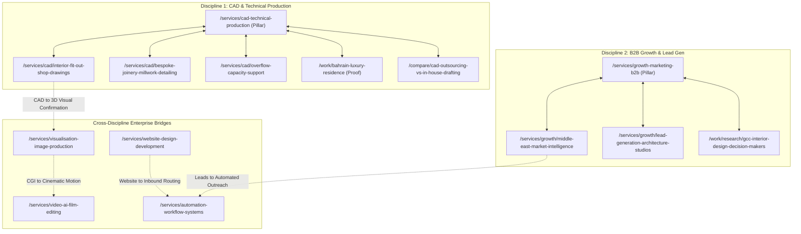

# XIYÀTO — Search Architecture, High-Priority Page Briefs & Acquisition Roadmap

**Brand**: XIYÀTO ([https://xiyato.uk](https://xiyato.uk))  
**Target Geographies**: UK, US, UAE, Saudi Arabia, Qatar, Australia, Canada, Singapore, Germany, Netherlands, Switzerland, France, Ireland.  
**North-Star KPI**: Qualified Inbound Commercial Enquiries (WhatsApp, Direct Telephone, Structured Briefs).

---

# Part 1: High-Priority Production Page Briefs

Below are comprehensive, production-ready specifications for the top-priority commercial acquisition assets. Each brief contains all structural, visual, technical, and conversion requirements.

---

## Page Brief 01: CAD Interior Fit-Out Shop Drawings
- **Proposed Canonical URL**: `https://xiyato.uk/services/cad/interior-fit-out-shop-drawings`
- **Page Archetype**: `SERVICE PAGE`
- **Primary Search Intent**: Active Procurement / Vendor Selection (`interior fit out shop drawing services`, `commercial fit out cad drafting`)
- **Secondary Intents**: `joinery shop drawings dwg`, `mep coordination drawings for fit out contractors`, `fast turnaround cad shop drawings middle east`
- **Target Buyer**: Commercial Fit-Out Contractor, Hotel Renovation Project Director, Luxury Retail General Contractor (UK, UAE, Saudi Arabia, Qatar).
- **SEO Title**: `Interior Fit-Out Shop Drawing Services | DWG & CAD | XIYÀTO` (58 chars)
- **Primary H1**: `Precision Interior Fit-Out Shop Drawings & Joinery CAD Production`
- **Recommended Section Hierarchy**:
  1. **Hero Header**: Above-the-fold value proposition: "Flawless technical drawings delivered within 72–96 hours, meeting stringent main-contractor submittal standards across the UK, GCC, and North America." Dual-region WhatsApp direct line (`+44 7882 746212` / `+91 70283 11226`) and "Submit Redlines for Quote" CTA.
  2. **The Procurement Problem**: Why fit-out projects stall: submittal rejections, uncoordinated MEP clashes, missing joinery section callouts, and factory fabrication rework costs.
  3. **Core Deliverable Specifications**: Detailed breakdown of what XIYÀTO produces:
     - 1:10 and 1:20 joinery fabrication details (concealed hinges, shadow gaps, veneer matching).
     - Reflected Ceiling Plans (RCP) coordinated with lighting, HVAC grilles, and fire sprinklers.
     - Wet area sanitary layouts, tile-setting centerlines, and waterproofing details.
     - Partition types, door schedules, and architectural hardware sets.
  4. **Interactive Drawing Sheet Viewer (Evidence)**: Direct embed of the **Bahrain Luxury Interior Package** (20 Ultra-HD drawing sheets with vector zoom, layer inspection, and downloadable sample PDF).
  5. **Layer Discipline & Drafting Standards**: Conformance to British Standard BS 1192, ISO 13567, and US AIA CAD Layer Guidelines. Full transparency on pen tables, CTB files, font hierarchies, and title block integration.
  6. **Turnaround SLAs & Review Cycles**: Transparent 4-step intake: (1) DWG/PDF & Redline receipt &rarr; (2) Production in 72–96 hrs &rarr; (3) Internal Senior QC review &rarr; (4) Two rounds of contractor markups included.
  7. **Direct Inbound Conversion Bar**: Dual WhatsApp buttons with prefilled message: *"Hello XIYÀTO, I have an interior fit-out project requiring shop drawing production. Please review my scope."* + Direct phone and structured brief form anchor.
- **Portfolio Evidence**: Bahrain Private Residence Drawing Set (Master Suite, Double-Height Living, Bespoke Dressing Room Joinery).
- **Images & Visual Assets**: High-resolution vector-rendered CAD sheets, before/after redline-to-CAD overlays, joinery detail callout cutouts.
- **Video Opportunities**: 30-second screen capture walkthrough demonstrating layer management and joinery detailing in AutoCAD.
- **Internal Links**:
  - *Inbound*: Link from `/services/cad-technical-production`, `/services`, `/work/bahrain-luxury-residence`, `/industries/commercial-fit-out-contractors`.
  - *Outbound*: Link to `/services/visualisation-image-production` (for 3D visual confirmation), `/work/bahrain-luxury-residence`, `/contact`.
- **External Standards Referenced**: ISO 13567 (CAD Layer Standard), BS 1192, AIA CAD Guidelines.
- **Structured Data Recommendation**:
  - `Service` schema (`serviceType: "Interior Fit-Out Shop Drawing Production"`, `provider: "XIYÀTO"`, `areaServed: ["GB", "AE", "SA", "QA", "US"]`).
  - `BreadcrumbList` (`Home > Services > CAD > Interior Fit-Out Shop Drawings`).
- **CTA & Conversion Mechanism**: Direct WhatsApp quote trigger, direct telephone link, file upload portal supporting up to 50MB DWG/PDF attachments.

---

## Page Brief 02: Middle East B2B Market Research & Lead Intelligence
- **Proposed Canonical URL**: `https://xiyato.uk/services/growth/middle-east-market-intelligence`
- **Page Archetype**: `SERVICE PAGE`
- **Primary Search Intent**: Commercial Investigation / Vendor Selection (`middle east b2b market research services`, `gcc b2b lead generation agency`)
- **Secondary Intents**: `verified buyer data uae saudi arabia`, `hospitality procurement contacts dubai`, `find commercial contractors middle east`
- **Target Buyer**: VP International Business, Export Sales Director, Managing Director of European/UK Luxury Material Manufacturers, Interior Brands, or Specialist Subcontractors.
- **SEO Title**: `Middle East B2B Market Research & Lead Intelligence | XIYÀTO` (59 chars)
- **Primary H1**: `Proprietary Middle East B2B Market Research & Verified Buyer Intelligence`
- **Recommended Section Hierarchy**:
  1. **Hero Header**: "Access verified C-suite, procurement, and project directors across the UAE, Saudi Arabia, and Qatar. Human-researched, telephone-verified B2B intelligence tailored to your export expansion."
  2. **The Middle East Acquisition Dilemma**: Why automated databases fail in the GCC: generic info@ inboxes, outdated LinkedIn profiles due to high turnover, unlisted holding company subsidiaries, and strict gatekeepers.
  3. **Proprietary Research Methodology**:
     - 100% human analyst verification (no stale scraper exports).
     - Direct telephone verification with local corporate offices.
     - Mobile phone and direct WhatsApp contact capture.
     - Complete corporate entity mapping (holding companies, sister firms, local sponsorship structures).
  4. **Data Sample & Interactive Sheet Viewer**: Embed live interactive sample of the **GCC Luxury Interior Design & Fit-Out Decision Makers Database** (showing columns: Company, Decision Maker, Verified Title, Direct Mobile, Project Types, Revenue Tier).
  5. **Covered Sectors in the GCC**:
     - Luxury Residential & Villa Developments.
     - Hospitality (5-star hotel operators, resort developers, asset managers).
     - Commercial Fit-Out & Turnkey Contracting.
     - High-End FF&E, Joinery & Bespoke Materials Specifiers.
  6. **Compliance & Deliverables**: Full compliance with local privacy regulations, deliverable formats (.XLSX, CSV, CRM import ready), and 98%+ deliverability guarantee.
  7. **Direct Conversion Bar**: "Request Custom Middle East Research Scope" CTA + WhatsApp link prefilled with: *"Hello XIYÀTO, we are seeking verified B2B intelligence for our Middle East expansion. Let's discuss requirements."*
- **Portfolio Evidence**: 7 Live B2B Workbooks (GCC Luxury Fit-Out, UAE Commercial Contractors, China Furniture Exporters, India Textile Suppliers).
- **Images & Visual Assets**: UI screenshots of spreadsheet databases with dark glassmorphism styling, data taxonomy diagrams, regional map highlighting UAE, KSA, and Qatar commercial hubs.
- **Video Opportunities**: None needed; interactive spreadsheet viewer provides higher commercial utility.
- **Internal Links**:
  - *Inbound*: Link from `/services/growth-marketing-b2b`, `/work/research/gcc-interior-design-decision-makers`, `/international/middle-east-hospitality-fitout`.
  - *Outbound*: Link to `/work/research/gcc-interior-design-decision-makers`, `/services/automation/whatsapp-inbound-lead-systems`, `/contact`.
- **Structured Data Recommendation**:
  - `Service` schema (`serviceType: "B2B Market Research & Lead Intelligence"`, `areaServed: ["AE", "SA", "QA", "GB", "US"]`).
  - `Dataset` schema for public research sample previews.
- **CTA & Conversion Mechanism**: Instant sample workbook download with business email capture, direct WhatsApp consultation with Lead Research Analyst.

---

## Page Brief 03: Photorealistic Furniture 3D Rendering Studio
- **Proposed Canonical URL**: `https://xiyato.uk/services/visualisation/photorealistic-furniture-rendering`
- **Page Archetype**: `SERVICE PAGE`
- **Primary Search Intent**: Commercial Investigation / Vendor Selection (`photorealistic furniture rendering services`, `3d furniture CGI studio`)
- **Secondary Intents**: `luxury furniture 3d visualization`, `furniture product renders for catalogue`, `architectural furniture cgi uk`
- **Target Buyer**: Creative Director, Head of Marketing, Product Development Lead at High-End Furniture Brands, Lighting Designers, Bespoke Joinery Studios (UK, US, Italy, France, Germany).
- **SEO Title**: `Photorealistic Furniture 3D Rendering Studio | XIYÀTO` (55 chars)
- **Primary H1**: `Ultra-Photorealistic 3D Furniture Rendering & Digital Material Craft`
- **Recommended Section Hierarchy**:
  1. **Hero Header**: "Replace expensive physical photoshoots with flawless digital CGI. Material-accurate 3D renders that capture fabric weave, leather patina, wood grain, and bespoke metal patinas."
  2. **The High Cost of Physical Furniture Photography**: The logistical nightmare of prototyping, studio rental, shipping fragile pieces, and set building vs. infinitely reconfigurable digital twins.
  3. **Micro-Detail Material Fidelity (The XIYÀTO Craft)**:
     - 8K PBR texture mapping (anisotropic reflections, displacement, subsurface scattering).
     - True-to-life seam stitching, piping, and organic cushion deformation.
     - Bespoke lighting rigs (warm residential ambient, brutalist minimalist gallery, technical e-commerce white).
  4. **Interactive Case Study / Visual Showcase**: The **Sultanah Moon Chair** project. Full-bleed interactive 360-degree turntable, material variant switcher (bouclé, cognac leather, brushed bronze, ebonized oak).
  5. **Multi-Channel Commercial Assets Generated**:
     - High-res print catalogue hero shots (up to 12K resolution).
     - E-commerce packshots on seamless neutral cycloramas.
     - Styled contextual interior vignettes (penthouse, minimalist salon).
     - Transparent background PNG cutouts for marketing collateral.
  6. **Client Production Workflow**: (1) CAD file / Reference photos intake &rarr; (2) 3D Clay render approval &rarr; (3) Material & shader calibration &rarr; (4) Lighting passes &rarr; (5) Final 4K/8K delivery.
  7. **Direct Conversion Bar**: WhatsApp trigger: *"Hello XIYÀTO, I have a furniture collection requiring 3D rendering. Let's review scope and timelines."* + Form for 3D model / photography upload.
- **Portfolio Evidence**: Sultanah Moon Chair campaign imagery, Bahrain bespoke joinery renders.
- **Images & Visual Assets**: Macro zoom details of fabric weave, clay render vs. shaded render sliders, exploded view diagrams of furniture joinery.
- **Video Opportunities**: 15-second looping 4K turntable render of the Sultanah Moon Chair.
- **Internal Links**:
  - *Inbound*: Link from `/services/visualisation-image-production`, `/services/video/luxury-furniture-brand-films`, `/work/sultanah-moon-chair`.
  - *Outbound*: Link to `/services/video/luxury-furniture-brand-films`, `/work/sultanah-moon-chair`, `/contact`.
- **Structured Data Recommendation**:
  - `Service` schema (`serviceType: "3D Product and Furniture Rendering"`).
  - `ImageGallery` / `VisualArtwork` schema.
- **CTA & Conversion Mechanism**: Request 1-Room / 1-Piece Sample Render Pilot, WhatsApp chat, Direct Telephone call.

---

## Page Brief 04: Luxury Furniture Brand Commercial Films
- **Proposed Canonical URL**: `https://xiyato.uk/services/video/luxury-furniture-brand-films`
- **Page Archetype**: `SERVICE PAGE`
- **Primary Search Intent**: Vendor Selection (`luxury furniture commercial video production`, `cinematic furniture brand film`)
- **Secondary Intents**: `furniture video production uk`, `architectural product video agency`, `high end furniture reels production`
- **Target Buyer**: Marketing VP, Brand Director, Creative Founder of High-End Furniture Manufacturers, Lighting Ateliers, and Luxury Living Brands.
- **SEO Title**: `Luxury Furniture Brand Commercial Video Production | XIYÀTO` (60 chars)
- **Primary H1**: `Cinematic Brand Films & Commercial Video for Luxury Furniture Ateliers`
- **Recommended Section Hierarchy**:
  1. **Hero Header**: Cinematic background video reel (Sultanah Moon Chair). "Capturing the tactile soul, sculptural silhouette, and craftsmanship of high-end design through cinematic video and AI-enhanced atmospheric storytelling."
  2. **Why Static Imagery Is No Longer Enough**: How motion drives emotional connection in luxury commerce; video increases dwell time, buyer conviction, and social engagement by 300%+.
  3. **Our Hybrid Production Pipeline**:
     - 4K cinematic cinematography & digital camera choreography.
     - Bespoke sound design (tactile audio: leather creak, wood resonance, atmospheric sub-bass).
     - AI-assisted atmospheric grading (light beam diffusion, subtle dust motes, dusk atmospheres).
     - Multi-aspect ratio mastering (16:9 4K widescreen for website/exhibitions, 9:16 for Instagram/LinkedIn reels).
  4. **Featured Campaign Case Study**: Full embed of the **Sultanah Moon Chair Film** with directorial notes, lighting setup diagrams, and storyboard panels.
  5. **Commercial Deliverable Tiers**:
     - *Tier 1: Master Brand Film (60–90 seconds)* — Cinematic manifesto for homepage hero and global exhibitions.
     - *Tier 2: Craftsmanship Vignettes (15–30 seconds)* — Material focus reels for paid social and product pages.
     - *Tier 3: Silent Showroom Loops (4K Looping)* — Optimized for high-end flagship retail displays and Milan/London Design Week booths.
  6. **Production Timeline & Global Delivery**: 2-week turnaround from script approval to color-graded master delivery.
  7. **Direct Conversion Bar**: WhatsApp trigger: *"Hello XIYÀTO, we are planning a commercial video campaign for our luxury collection. Let's discuss."* + Telephone link.
- **Portfolio Evidence**: Sultanah Moon Chair campaign film, architectural flythrough edits.
- **Images & Visual Assets**: Cinematic stills, color grading before/after comparisons, storyboard sketches.
- **Video Opportunities**: Embedded 4K Sultanah Moon Chair video with custom playback controls.
- **Internal Links**:
  - *Inbound*: Link from `/services/video-ai-film-editing`, `/services/visualisation/photorealistic-furniture-rendering`, `/work/sultanah-moon-chair`.
  - *Outbound*: Link to `/services/visualisation/photorealistic-furniture-rendering`, `/work/sultanah-moon-chair`, `/contact`.
- **Structured Data Recommendation**:
  - `VideoObject` schema (`name: "Sultanah Moon Chair Cinematic Commercial"`, `description: "Cinematic commercial film showcasing bespoke furniture design"`, `thumbnailUrl`, `uploadDate`).
  - `Service` schema (`serviceType: "Commercial Video Production"`).
- **CTA & Conversion Mechanism**: Request Treatment & Budget Proposal, WhatsApp creative consultation.

---

## Page Brief 05: Website Design Agency for Architecture Practices
- **Proposed Canonical URL**: `https://xiyato.uk/services/web/architecture-firm-website-design`
- **Page Archetype**: `INDUSTRY PAGE`
- **Primary Search Intent**: Vendor Selection (`website design agency for architecture practices`, `architect portfolio web design`)
- **Secondary Intents**: `best architecture website development`, `next js web agency for architects`, `minimalist architecture firm websites uk`
- **Target Buyer**: Managing Partner, Marketing Director, Studio Principal of Architecture & Interior Practices (London, New York, Sydney, Singapore, Zurich).
- **SEO Title**: `Architecture Firm Website Design Agency | Next.js | XIYÀTO` (58 chars)
- **Primary H1**: `High-Performance Minimalist Websites Engineered for Architecture Practices`
- **Recommended Section Hierarchy**:
  1. **Hero Header**: "Websites that honor architectural discipline. Pure editorial typography, sub-second load times, interactive vector plan viewers, and 100/100 Core Web Vitals engineered on Next.js."
  2. **The Fatal Flaw of Standard Agency Web Design**: Why typical WordPress and heavy Webflow sites fail architects: sluggish image galleries, bloated code, layout shifts, poor mobile rendering of drawings, and generic templates.
  3. **Architectural Web Engineering Standards**:
     - *Instant Page Transitions*: Next.js App Router with Server-Side Rendering (SSR) and edge caching.
     - *Native Vector DWG / Plan Viewers*: Interactive pan-and-zoom inspection for floorplans and sections without PDF download friction.
     - *Editorial Typography & Grid Systems*: Inspired by Swiss International Style and architectural monograph layouts.
     - *Zero Maintenance Overhead*: Headless CMS or git-backed Markdown for frictionless project publishing.
  4. **Live Benchmark Evidence**: Performance audit of XIYÀTO's own production site: 100 Performance, 100 SEO, 100 Best Practices, <0.1s LCP, zero layout shift.
  5. **Essential Features for High-Ticket Client Acquisition**:
     - Project filtering by typology (Residential, Commercial, Civic, Hospitality).
     - High-density press & monograph download centers.
     - Private client presentation portals for confidential tender submittals.
     - Integrated WhatsApp and telephone inquiry triggers with attribution tracking.
  6. **Pricing & Engagement Model**: Fixed-scope investment tiers (£12,000–£35,000) with guaranteed 4–6 week deployment.
  7. **Direct Conversion Bar**: WhatsApp trigger: *"Hello XIYÀTO, we want to redesign our architecture practice website. Let's schedule a review."* + Architecture site audit request form.
- **Portfolio Evidence**: XIYÀTO website platform, interactive CAD viewer, responsive minimalism.
- **Images & Visual Assets**: Side-by-side performance audits (99+ Lighthouse vs. typical 40/100 WordPress), responsive mobile mockups showing architectural drawings.
- **Video Opportunities**: 10-second screen capture demonstrating sub-second page transitions and vector plan zooming.
- **Internal Links**:
  - *Inbound*: Link from `/services/website-design-development`, `/services/cad-technical-production`, `/industries/luxury-interior-design-studios`.
  - *Outbound*: Link to `/services/cad-technical-production`, `/services/automation/whatsapp-inbound-lead-systems`, `/contact`.
- **Structured Data Recommendation**:
  - `Service` schema (`serviceType: "Architecture Firm Website Design & Development"`).
  - `WebSite` / `SoftwareApplication` schema.
- **CTA & Conversion Mechanism**: Free 15-Minute Architectural Website Audit, WhatsApp call, Structured Project Intake form.

---

## Page Brief 06: WhatsApp Inbound Lead Automation Systems
- **Proposed Canonical URL**: `https://xiyato.uk/services/automation/whatsapp-inbound-lead-systems`
- **Page Archetype**: `SERVICE PAGE`
- **Primary Search Intent**: Active Procurement / Solution Evaluation (`whatsapp lead automation systems`, `whatsapp lead routing for high ticket services`)
- **Secondary Intents**: `inbound whatsapp crm integration`, `automated lead qualification whatsapp uk uae`, `whatsapp api business automation`
- **Target Buyer**: Commercial Director, Managing Partner, High-Ticket Service Founder (UAE, Saudi Arabia, UK, Singapore, Australia).
- **SEO Title**: `WhatsApp Inbound Lead Automation Systems | XIYÀTO` (52 chars)
- **Primary H1**: `Turn Inbound WhatsApp Chats into Qualified Enterprise Service Enquiries`
- **Recommended Section Hierarchy**:
  1. **Hero Header**: "Capture high-intent buyers the moment they arrive. Automated routing, contextual service prefilling, instant CRM sync, and multi-region telephone handling that eliminates lead drop-off."
  2. **The Multi-Million Pound Inbound Problem**: High-value buyers (especially in the Middle East and UK) refuse to fill out 12-field web forms; they expect immediate WhatsApp dialogue. Unanswered chats result in immediate lost contracts.
  3. **The XIYÀTO Inbound Architecture**:
     - *Contextual Deep-Linking*: URL parameters automatically prefill the prospect's WhatsApp message with the exact service and project type they were viewing.
     - *Dual-Hub Routing*: Intelligent triage between UK management (`+44 7882 746212`) and technical production hubs (`+91 70283 11226`).
     - *CRM & Telemetry Sync*: Captures incoming UTM parameters, time of contact, and qualification notes into HubSpot, Airtable, or Notion via automated webhooks.
     - *Zero-Spam Conversational Triage*: Graceful, human-like automated qualification that collects project drawings and budget tiers before alerting senior partners.
  4. **Live System Demonstration**: Interactive CTA where the prospect clicks a test button to witness instantaneous prefilled routing and qualification.
  5. **Implementation Stack**: Official WhatsApp Business Cloud API, Make.com / Zapier webhooks, HubSpot / custom database integrations.
  6. **Commercial Impact Metrics**: 350% increase in inbound response rates, sub-60-second lead contact time, 100% attribution tracking from paid/organic channels.
  7. **Direct Conversion Bar**: WhatsApp trigger: *"Hello XIYÀTO, I want to implement WhatsApp lead automation for our firm. Please share details."* + Direct call link.
- **Portfolio Evidence**: XIYÀTO live inbound WhatsApp routing engine (mounted on `xiyato.uk`).
- **Images & Visual Assets**: Architecture flowcharts showing webhook routes, CRM lead card creation, and mobile chat UI mockups.
- **Video Opportunities**: None needed; live clickable demo is more compelling.
- **Internal Links**:
  - *Inbound*: Link from `/services/automation-workflow-systems`, `/services/growth/middle-east-market-intelligence`, `/services/web/architecture-firm-website-design`.
  - *Outbound*: Link to `/services/growth-marketing-b2b`, `/services/website-design-development`, `/contact`.
- **Structured Data Recommendation**:
  - `Service` schema (`serviceType: "Inbound Lead Automation & WhatsApp Systems"`).
  - `HowTo` schema outlining the 4-step lead capture workflow.
- **CTA & Conversion Mechanism**: Click-to-Test Live WhatsApp Routing, Book a 20-Minute Automation Architecture Review.

---

# Part 2: Top 20 Immediate Page Opportunities

These 20 pages represent the highest immediate commercial leverage for XIYÀTO, chosen because they target buyers actively looking to spend £10,000–£100,000+, have realistic ranking difficulty, and can be backed immediately by XIYÀTO's existing verified proof assets.

| Rank | Page Title | Proposed URL | Archetype | Target Discipline | Primary Target Query | Target Geography | Est. Deal Value | Available Proof Asset |
|:---:|---|---|---|---|---|---|:---:|---|
| **01** | Interior Fit-Out Shop Drawing Services | `/services/cad/interior-fit-out-shop-drawings` | SERVICE PAGE | CAD Drafting | `interior fit out shop drawing services` | UAE, Saudi, UK, Qatar | £25k–£120k | Bahrain 20-Sheet CAD Set |
| **02** | Middle East B2B Market Intelligence | `/services/growth/middle-east-market-intelligence` | SERVICE PAGE | Growth / B2B | `middle east b2b market research services` | UK, US, Germany, UAE | £20k–£90k | 7 Research Workbooks |
| **03** | Photorealistic Furniture 3D Rendering | `/services/visualisation/photorealistic-furniture-rendering` | SERVICE PAGE | 3D Visualisation | `photorealistic furniture rendering services` | UK, US, Italy, France | £8k–£35k | Sultanah Moon Chair CGI |
| **04** | Luxury Furniture Brand Commercial Films | `/services/video/luxury-furniture-brand-films` | SERVICE PAGE | Video & AI Film | `luxury furniture brand commercial video production` | UK, US, France | £15k–£50k | Sultanah 4K Campaign Film |
| **05** | Architecture Firm Website Design Agency | `/services/web/architecture-firm-website-design` | INDUSTRY PAGE | Web Development | `website design agency for architecture practices` | UK, US, Australia | £15k–£60k | XIYÀTO Platform & CAD Viewer |
| **06** | WhatsApp Inbound Lead Automation | `/services/automation/whatsapp-inbound-lead-systems` | SERVICE PAGE | Automation | `whatsapp lead automation systems for high ticket services` | UAE, Saudi, UK | £8k–£30k | Live XIYÀTO Routing Engine |
| **07** | Bespoke Joinery & Millwork Detailing | `/services/cad/bespoke-joinery-millwork-detailing` | SERVICE PAGE | CAD Drafting | `joinery detailing services for interior designers` | UK, Ireland, Australia | £10k–£40k | Bahrain Master Wardrobe DWG |
| **08** | Luxury Interior Design Decision-Maker Data | `/work/research/gcc-interior-design-decision-makers` | BUYER PAGE | Growth / B2B | `luxury interior design decision maker data` | UK, US, GCC | £8k–£35k | 1,200+ Verified GCC Contacts |
| **09** | Architectural Drawing Overflow Support | `/services/cad/overflow-capacity-support` | BUYER PAGE | CAD Drafting | `architectural drawing production overflow` | UK, US, Canada | £20k–£80k | 4-Day SLA / Redline Protocol |
| **10** | UK Architectural Drafting Services | `/international/uk-architectural-drafting-services` | COUNTRY PAGE | CAD Drafting | `outsourced cad drafting services uk` | UK | £15k–£75k | BS 1192 / UK Regs Compliance |
| **11** | Middle East Hospitality Fit-Out Production | `/international/middle-east-hospitality-fitout` | COUNTRY PAGE | CAD & 3D Viz | `hospitality fit out cad drafting middle east` | UAE, Saudi, Qatar | £30k–£150k | Gulf Villa & Hotel Draw Sets |
| **12** | Luxury Interior Design Web Studio | `/services/web/luxury-interior-design-websites` | INDUSTRY PAGE | Web Development | `luxury interior designer website design uk` | UK, US, France | £12k–£40k | Dark Editorial UI & Galleries |
| **13** | Unbuilt Property Marketing CGI London | `/services/visualisation/unbuilt-property-marketing-cgi` | SERVICE PAGE | 3D Visualisation | `unbuilt property marketing renders london` | UK | £15k–£60k | Photorealistic Penthouse CGI |
| **14** | CAD Outsourcing vs In-House Cost Analysis | `/compare/cad-outsourcing-vs-in-house-drafting` | COMPARISON | CAD Drafting | `cad outsourcing vs in house drafting cost` | UK, US | £30k–£100k saved | Salary & Overhead Model |
| **15** | B2B Lead Gen for Architecture Studios | `/services/growth/lead-generation-architecture-studios` | INDUSTRY PAGE | Growth / B2B | `b2b lead generation for architecture and design studios` | UK, US | £12k–£48k | Verified Developer Pipeline |
| **16** | Cinematic Architectural Video Production UK | `/services/video/cinematic-architectural-video-uk` | SERVICE PAGE | Video & AI Film | `cinematic architectural video production uk` | UK | £12k–£45k | 4K Architectural Reels |
| **17** | Inbound Enquiry Routing & CRM Automation | `/services/automation/inbound-enquiry-crm-routing` | SERVICE PAGE | Automation | `inbound enquiry routing and crm automation for agencies` | UK, US, Canada | £10k–£35k | UTM Attribution Engine |
| **18** | Reflected Ceiling Plan & MEP Coordination | `/services/cad/reflected-ceiling-plan-coordination` | SERVICE PAGE | CAD Drafting | `reflected ceiling plan lighting coordination drawings` | UK, Australia | £8k–£25k | Multi-Circuit Lighting DWGs |
| **19** | Architectural Rendering Pricing Guide UK | `/guides/architectural-rendering-pricing-guide-uk` | GUIDE | 3D Visualisation | `3d architectural rendering pricing guide uk` | UK, Ireland | £10k–£40k | Transparent Rate Card Matrix |
| **20** | GCC Commercial Fit-Out Contractor Database | `/work/research/gcc-commercial-contractors-database` | BUYER PAGE | Growth / B2B | `commercial fit out contractor prospect database gcc` | UAE, Saudi | £15k–£50k | 850+ Contractor Exec Contacts |

---

# Part 3: Top 50 Subsequent Opportunities (Expansion Roadmap)

These 50 opportunities expand XIYÀTO's international footprint across secondary intent vectors, technical buyer niches, and comparative procurement queries.

### CAD & Technical Production (1–10)
21. `/services/cad/bim-coordination-detailing` — BIM to 2D CAD conversion for construction submittals (US, CA, AU)
22. `/services/cad/luxury-residential-mep-coordination` — MEP coordination drawings for prime private villas (UAE, CH)
23. `/services/cad/as-built-drawing-services` — Measured survey to CAD as-built drafting (UK, US)
24. `/services/cad/commercial-door-window-schedules` — Architectural hardware and opening schedules in DWG (UK, AU)
25. `/services/cad/tile-setting-sanitary-elevations` — Stone, marble, and tile cut-setting drawings (UK, UAE)
26. `/services/cad/tender-drawing-package-production` — Complete RIBA Stage 4 tender documentation packages (UK, IE)
27. `/guides/architectural-cad-layer-standards-guide` — Technical comparative guide: AIA vs ISO 13567 (Global)
28. `/guides/interior-fitout-drawing-checklist` — What contractors must verify before factory fabrication (UK, GCC)
29. `/compare/autocad-vs-revit-for-interior-fitouts` — Objective technical analysis for interior design practices (Global)
30. `/faq/cad-outsourcing-security-and-turnaround` — Data security, NDA protocol, and revision limits FAQ (Global)

### B2B Growth, Research & Lead Generation (11–19)
31. `/work/research/european-furniture-manufacturers-intelligence` — Verified European furniture factory buyers (DE, NL, UK)
32. `/work/research/us-architecture-principal-directory` — Key decision-makers in top 500 US architectural firms (US)
33. `/services/growth/apac-b2b-lead-intelligence` — Verified enterprise prospect research in Singapore and Australia (SG, AU)
34. `/services/growth/export-market-feasibility-research` — Commercial market entry research for luxury brands (UK, EU)
35. `/guides/procuring-hospitality-contracts-middle-east` — Guide on how to get specified by GCC hotel operators (UK, US, FR)
36. `/guides/how-to-verify-b2b-prospect-data` — Human research protocols vs automated email scraper tools (Global)
37. `/compare/human-verified-b2b-research-vs-automated-scrapers` — Email bounce rates, spam traps, and ROI analysis (Global)
38. `/solutions/for-commercial-directors` — Persona landing page for B2B pipeline growth and outbound sales (UK, US)
39. `/faq/b2b-data-compliance-and-gdpr` — GDPR, PECR, and international data privacy compliance FAQ (UK, EU)

### 3D Visualisation & Image Production (20–28)
40. `/services/visualisation/middle-east-architectural-cgi` — Mega-development and luxury villa CGI (UAE, SA, QA)
41. `/services/visualisation/hospitality-resort-cgi` — High-end hotel and beach resort rendering (UAE, CH, FR)
42. `/services/visualisation/architectural-competition-rendering` — Atmospheric imagery for architectural tenders (UK, DE, CH)
43. `/services/visualisation/commercial-exterior-rendering-usa` — Office and mixed-use architectural rendering (US, CA)
44. `/work/bahrain-master-bedroom-visualisation` — In-depth CGI study of materials, daylighting, and luxury finishes (Global)
45. `/guides/how-to-prepare-cad-files-for-3d-rendering` — Guide for architects on cleaning DWG/3D models before CGI (Global)
46. `/compare/3d-rendering-vs-physical-photography-costs` — Economic breakdown for furniture catalogues and interiors (Global)
47. `/solutions/for-design-principals` — Persona page: preserving design intent during client presentations (UK, US)
48. `/industries/luxury-furniture-brands` — Unified discipline hub (3D Renders + Films + Web + B2B) (Global)

### Video, AI Film & Editing (29–36)
49. `/services/video/ai-commercial-video-production` — Hybrid live-action, 3D CGI, and AI atmospheric enhancement (US, UK, UAE)
50. `/services/video/social-video-editorial-design-brands` — Monthly 9:16 vertical video editing retainers for design studios (UK, US)
51. `/services/video/showroom-cinematic-loops` — 4K looping display reels for retail showrooms and trade fairs (IT, FR, UK)
52. `/guides/architectural-walkthrough-video-production-cost` — Cost benchmarks by seconds of runtime and render complexity (UK, AU)
53. `/guides/how-to-storyboard-luxury-product-films` — Narrative pacing and macro cinematography guide (Global)
54. `/work/sultanah-moon-chair-film-retrospective` — Complete technical breakdown: lighting, sound design, AI styling (Global)
55. `/compare/ai-generated-video-vs-cgi-animation` — Quality, consistency, and brand suitability evaluation (Global)
56. `/faq/commercial-video-licensing-and-assets` — Commercial music rights, 4K master files, and raw footage FAQ (Global)

### Website Design & Development (37–44)
57. `/services/web/custom-nextjs-web-development-uk` — Enterprise-grade Next.js App Router engineering (UK, US, DE)
58. `/services/web/furniture-brand-ecommerce-portfolios` — High-end furniture ateliers and design showrooms (IT, FR, UK)
59. `/services/web/headless-cms-development` — Markdown/Sanity headless setups for creative studios (NL, CH, UK)
60. `/services/web/portfolio-websites-for-interior-designers` — Bespoke portfolio development for high-end decorators (UK, US)
61. `/guides/core-web-vitals-for-portfolio-websites` — Why fast sites rank higher and convert high-ticket clients (Global)
62. `/compare/custom-nextjs-vs-webflow-for-architecture` — Performance, vendor lock-in, and code ownership comparison (Global)
63. `/compare/headless-cms-vs-wordpress-for-studios` — Security, speed, and publishing ergonomics comparison (Global)
64. `/faq/website-development-process-and-maintenance` — Hosting on Vercel, DNS migration, and ongoing retainer FAQ (Global)

### Automation & Marketing Systems (45–50)
65. `/services/automation/middle-east-sales-pipeline-systems` — Bilingual (EN/AR) CRM routing and WhatsApp lead systems (UAE, SA)
66. `/services/automation/hubspot-lead-routing-workflows` — Advanced lifecycle stages and lead qualification triggers (UK, IE, DE)
67. `/services/automation/rfp-intake-and-proposal-acceleration` — Streamlining technical proposal production for agencies (UK, US, AU)
68. `/guides/agency-proposal-turnaround-automation` — Reducing tender turnaround time from 7 days to 24 hours (Global)
69. `/compare/make-vs-zapier-for-enterprise-agencies` — Cost, data privacy, error handling, and complex webhook support (Global)
70. `/faq/automation-integration-and-data-security` — API limits, webhook encryption, and staff training FAQ (Global)

---

# Part 4: Content That Should NOT Be Created (The Negative List)

To preserve XIYÀTO's luxury brand equity, avoid algorithmic spam downgrades, and maintain high commercial conversion rates, the following content types are **strictly prohibited**:

```
🚫 THE NEGATIVE CONTENT LIST
```

1. **Mass Programmatic City Clones**:
   - *Prohibited Examples*: `/cad-drafting-services-london`, `/cad-drafting-services-manchester`, `/cad-drafting-services-birmingham`, `/cad-drafting-services-dubai`.
   - *Why*: Google's Helpful Content and Doorway Page algorithms actively penalize sites that duplicate page templates with swapped geographical tokens. It degrades brand prestige and signals cheap spam to enterprise buyers.

2. **Low-Intent Student / Hobbyist Queries**:
   - *Prohibited Examples*: `free autocad blocks download`, `how to learn 3ds max for beginners`, `cracked revit software`, `sample resume for cad drafter`.
   - *Why*: Generates thousands of vanity clicks from individuals with £0 purchasing intent, burdening server resources and distorting analytics attribution without producing a single qualified commercial enquiry.

3. **Fake Office / Fictitious Physical Footprint Pages**:
   - *Prohibited Examples*: Claiming physical studio offices in New York, Paris, or Dubai where XIYÀTO does not possess registered commercial leases.
   - *Why*: Violates Google Business Profile guidelines and search engine entity verification. Transparently positioning XIYÀTO as a dual UK-hub & international production studio establishes genuine operational trust without legal exposure.

4. **Generic AI-Generated "Thought Leadership" Fluff**:
   - *Prohibited Examples*: "The Future of AI in Architecture 2026", "Why Good Design Matters", "Top 10 Interior Design Trends".
   - *Why*: Generic articles lacking proprietary data or real project deliverables get demoted as unhelpful content and fail to persuade senior procurement directors.

5. **Keyword-Stuffed FAQs and Accordion Farms**:
   - *Prohibited Examples*: Hidden accordion blocks packed with semantic keyword permutations (*"Who is the best CAD drafter in London? Why hire a CAD drafter in London?"*).
   - *Why*: Visible text must serve human decision-makers. Algorithmic engines now assess user engagement; hidden keyword blocks damage conversion rates and raise spam flags.

---

# Part 5: Existing Site Consolidation Plan

Audit of current live routes on `xiyato.uk` and recommendations for consolidation:

| Current Live Route | Current State | Recommendation | Commercial Rationale |
|---|---|---|---|
| `/services` | General directory listing all 6 service lines | **Enhance** | Maintain as primary commercial gateway; add direct WhatsApp action bars and proof-sheet anchors. |
| `/services/cad-technical-production` | Live service pillar | **Enhance (Pillar)** | Expand with interactive Bahrain CAD sheet viewer and explicit links to new specialized sub-services (`/services/cad/interior-fit-out-shop-drawings`). |
| `/services/growth-marketing-b2b` | Live service pillar | **Enhance (Pillar)** | Integrate embedded data dictionary sample and links to `/services/growth/middle-east-market-intelligence`. |
| `/services/visualisation-image-production` | Live service pillar | **Enhance (Pillar)** | Add Sultanah Moon Chair 3D turntable and links to `/services/visualisation/photorealistic-furniture-rendering`. |
| `/services/video-ai-film-editing` | Live service pillar | **Enhance (Pillar)** | Mount 4K Sultanah film reel and link to `/services/video/luxury-furniture-brand-films`. |
| `/services/website-design-development` | Live service pillar | **Enhance (Pillar)** | Add Core Web Vitals audit badge and links to `/services/web/architecture-firm-website-design`. |
| `/services/automation-workflow-systems` | Live service pillar | **Enhance (Pillar)** | Mount interactive WhatsApp triage demo and link to `/services/automation/whatsapp-inbound-lead-systems`. |
| `/work/research/[slug]` (7 Workbooks) | Standalone raw spreadsheet viewers | **Consolidate / Enrich** | Wrap raw sheets in commercial context: add executive research summaries, data methodology, and direct "Order Custom Intelligence" CTAs. |
| `/company/locations` | Minimal text mentioning UK and India | **Enrich as Country Hub** | Upgrade with international delivery credentials, timezone overlap charts (GMT, EST, GST, IST), and verified legal status. |
| `/careers` | Minimal placeholder | **Retain as Low-Priority** | Keep `noindex` or minimal footprint to focus search crawl budget on revenue-generating commercial assets. |

---

# Part 6: Internal-Link Architecture & Topic Clusters

The architecture follows a strict **Hub-and-Spoke Semantic Cluster Model**. Every specialized sub-page, case study, and comparison points upward to its discipline Pillar Page, while cross-discipline bridge links facilitate multi-service enterprise engagements.



### Anchor Text Governance Rules:
1. **Descriptive & Commercial**: Always use descriptive phrases representing technical capabilities (e.g., *"view our interior fit-out shop drawing packages"* instead of *"click here"* or *"learn more"*).
2. **Breadcrumb Strictness**: Every deep page includes structured schema-backed breadcrumbs: `Home > Services > CAD > Interior Fit-Out Shop Drawings`.
3. **No Orphan Pages**: Every newly created page must receive a minimum of **3 inbound contextual links** from related service pillars, case studies, or the main navigation.

---

# Part 7: Expected Acquisition Role of Every Proposed Page

Every URL within XIYÀTO's digital ecosystem is assigned an explicit commercial acquisition role to ensure it directly advances the buyer through the qualification pipeline:

```
ACQUISITION FUNNEL ROLES:
1. FRONT-LINE ATTRACTOR (Top of Funnel — Problem Aware)
2. COMMERCIAL QUALIFIER (Middle of Funnel — Solution Evaluation)
3. PROCUREMENT CLOSER (Bottom of Funnel — Active RFP / Vendor Selection)
4. AUTHORITY & ENTITY ANCHOR (Corporate Trust & Backlink Magnet)
```

| URL | Primary Page Role | Target Interaction | Downstream Conversion Action |
|---|---|---|---|
| `/services/cad-technical-production` | **Commercial Qualifier** | Evaluates studio scale, software stack, and layer standards | Clicks to inspect Bahrain drawings or launches direct WhatsApp brief |
| `/services/cad/interior-fit-out-shop-drawings` | **Procurement Closer** | Fit-out contractor reviewing shop drawing turnaround SLAs | Submits tender drawings for 72-hour turnaround quote |
| `/services/cad/overflow-capacity-support` | **Front-Line Attractor** | Overburdened practice principal seeking immediate drawing help | Initiates emergency capacity discussion via direct WhatsApp |
| `/compare/cad-outsourcing-vs-in-house-drafting` | **Commercial Qualifier** | Managing director modeling salary vs outsourcing economics | Requests studio pricing rate card or capacity consultation |
| `/work/bahrain-luxury-residence` | **Procurement Closer** | Deep technical inspection of 20 Ultra-HD vector drawing sheets | Confirms technical competence & initiates project quote |
| `/services/growth-marketing-b2b` | **Commercial Qualifier** | Assesses data verification methodology and compliance | Explores sample databases and requests custom market scope |
| `/services/growth/middle-east-market-intelligence` | **Procurement Closer** | Export director sourcing verified UAE/Saudi decision-makers | Orders custom intelligence sample batch via WhatsApp |
| `/work/research/gcc-interior-design-decision-makers` | **Procurement Closer** | Interacting with live spreadsheet data dictionary | Downloads sample Excel sheet and requests tailored extract |
| `/services/visualisation-image-production` | **Commercial Qualifier** | Reviewing architectural rendering portfolio and lighting quality | Submits architectural model for CGI quotation |
| `/services/visualisation/photorealistic-furniture-rendering` | **Procurement Closer** | Luxury furniture brand evaluating digital material craft | Uploads CAD model for 3D digital material test |
| `/services/video/luxury-furniture-brand-films` | **Procurement Closer** | Brand marketing director watching 4K Sultanah Moon Chair film | Requests creative treatment and commercial campaign budget |
| `/services/web/architecture-firm-website-design` | **Procurement Closer** | Architecture partner testing sub-second Next.js plan viewer | Requests architectural website performance audit |
| `/services/automation/whatsapp-inbound-lead-systems` | **Procurement Closer** | Commercial director experiencing live WhatsApp routing demo | Books 20-minute automation architecture implementation call |
| `/international/uk-architectural-drafting-services` | **Authority & Entity Anchor** | UK practice verifying RIBA stages and London hub presence | Calls London direct line (`+44 7882 746212`) or submits brief |
| `/international/middle-east-hospitality-fitout` | **Authority & Entity Anchor** | GCC hospitality contractor verifying regional project track record | Initiates Gulf tender drawing review via WhatsApp |
