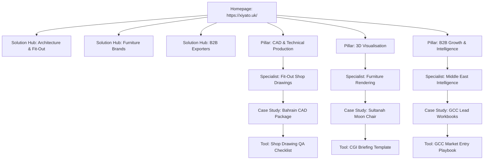

# XIYÀTO — GOOGLE SEARCH MARKET OWNERSHIP SYSTEM MASTER SPECIFICATION & ROADMAP

**Document ID**: XIYATO-SEO-OWNERSHIP-2026-V1  
**Date**: September 6, 2026  
**Website**: https://xiyato.uk/  
**Search Console Status**: Verified Active Domain Property (`sc-domain:xiyato.uk`)  
**Production Commit**: `be1c894` on branch `main`  
**Primary Objective**: Qualified Commercial Search Visibility → Qualified Inbound Enquiries → Long-Term Client Value.  

---

## 1. Governing Principles & Zero-Trust SEO Standard

XIYÀTO's search strategy does not pursue vanity page counts, low-intent informational traffic, or automated content volume. Its single commercial purpose is to build the web's most authoritative, trusted, and demonstrable search presence across the six commercial service disciplines XIYÀTO genuinely delivers.

### Strict Non-Negotiable Guardrails:
- **Zero Spam & Doorway Pages**: No generic programmatic landing pages, no thin regional clones, and no synthetic keyword permutation pages.
- **Zero Fabrication**: No fabricated statistics, false case study claims, artificial reviews, or simulated client offices.
- **Proof-First Architecture**: Every commercial service page must present tangible visual or technical proof (CAD drawing sheets, 3D digital twins, verified lead sheets, sub-second web performance metrics).
- **Compounding Search Loop**: Search demand → Authoritative page → Tangible proof → Search Console verification → Inbound enquiry → Completed commercial delivery → New proof asset → Compounding organic visibility.

---

## 2. Google Search Console: The Primary Source of Truth

### 2.1. Domain Property Verification Status
- **Property ID**: `sc-domain:xiyato.uk` (`[ACCOUNT-UI VERIFIED]` via user console inspection).
- **Verification Mechanism**: DNS TXT record (`google-site-verification=IjQduuSOmYJmgmhyNk6YA2rpWUe2b5uaPPdpGb-fLFs`) configured directly in Vercel authoritative DNS (`rec_db43fe3400c070e802c13e3d`).
- **Secondary Verification**: HTML meta tag `<meta name="google-site-verification" content="IjQduuSOmYJmgmhyNk6YA2rpWUe2b5uaPPdpGb-fLFs"/>` live on production (`https://xiyato.uk/`).
- **Initial Processing Window**: Google Search Console is currently aggregating its first 24–48 hour performance and coverage datasets (*'Processing data, please check again in a day or so'*).

### 2.2. Freshness & Brand Footprint Audit
- **Instagram Handle Update**: Deprecated `@xiyato22` purged across the entire repository and replaced with **`@xiyato.uk`** (`https://www.instagram.com/xiyato.uk/`) in UI footers and Schema.org metadata.
- **SERP Cache Observation**: Google Search queries for `"xiyato.uk"` show that Googlebot has indexed the core multidisciplinary brand footprint, though cached snippets temporarily reflect older copy. Sitemaps submission and URL inspection requests will force snippet refresh.
- **Sitemap Pipeline**: `https://xiyato.uk/sitemap.xml` (HTTP 200 OK, 28 clean static routes, truthful per-page Git commit timestamps).

---

## 3. Master Commercial Query Graph & Priority Scoring

The Master Query Graph is maintained as structured data in `data/seo/master_query_graph.json` and categorized into three target customer universes:
- **Universe A**: Architecture, Interior & Fit-Out Businesses (`A_FITOUT_AEC`)
- **Universe B**: Luxury Furniture & Product Brands (`B_FURNITURE_BRANDS`)
- **Universe C**: International Manufacturers & Exporters (`C_B2B_EXPORTERS`)

### Priority Scoring Methodology (1–100):
- **Commercial Intent Weight (40%)**: Urgency, commercial budget potential (>£2,000 target contract), and buyer decision stage.
- **Commercial Value Weight (30%)**: Lifetime client value and recurring overflow capacity potential.
- **XIYÀTO Proof Weight (20%)**: Availability of demonstrable, unredacted drawing sets, 3D models, or workbooks.
- **SERP Feasibility Weight (10%)**: Competitor strength and realistic ability to out-rank via technical depth.

### Master Query Graph Matrix (Top Opportunities):

| Query ID | Commercial Search Query | Service Moat | Universe | Buyer Persona | Intent | Priority | Target Destination URL | Action | Proof Asset |
| :--- | :--- | :--- | :--- | :--- | :--- | :--- | :--- | :--- | :--- |
| `Q-CAD-001` | interior fit out shop drawings | CAD | Fit-Out | Commercial Fit-Out Director | High Commercial | **98** | `/services/cad/interior-fit-out-shop-drawings` | `IMPROVE` | Bahrain 8-sheet DWG/PDF package |
| `Q-3D-001` | photorealistic furniture rendering services | 3D/CGI | Furniture | E-Commerce Creative Director | High Commercial | **97** | `/services/visualisation/photorealistic-furniture-rendering` | `IMPROVE` | Sultanah Moon Chair velvet digital twin |
| `Q-B2B-001` | middle east b2b market intelligence | B2B Research | Exporters | International Export VP | High Commercial | **96** | `/services/growth/middle-east-market-intelligence` | `IMPROVE` | GCC 55-firm verified contractor workbook |
| `Q-WEB-001` | architecture firm website design agency | Web | Fit-Out | Architecture Managing Partner | High Commercial | **95** | `/services/website-design-development` | `IMPROVE` | xiyato.uk Next.js 16 sub-second architecture |
| `Q-CAD-002` | outsourced cad drafting uk | CAD | Fit-Out | Architecture Studio Principal | High Commercial | **94** | `/services/cad-technical-production` | `IMPROVE` | UK/India overnight delivery workflow |
| `Q-AUT-001` | whatsapp b2b lead routing automation | Automation | Exporters | Head of Commercial Sales | High Commercial | **94** | `/services/automation-workflow-systems` | `IMPROVE` | Native multi-territory WhatsApp routing |
| `Q-B2B-002` | saudi arabia interior fit out contractors directory | B2B Research | Exporters | Export Material Supplier | High Commercial | **94** | `/services/growth/middle-east-market-intelligence` | `MERGE` | Riyadh/Jeddah verified trade database |
| `Q-3D-002` | 3d architectural rendering studio london | 3D/CGI | Fit-Out | Property Developer / Architect | High Commercial | **93** | `/services/visualisation-image-production` | `IMPROVE` | Master bathroom travertine architectural CGI |
| `Q-CAD-003` | joinery shop drawings london | CAD | Fit-Out | Bespoke Millwork Contractor | Transactional | **92** | `/services/cad/interior-fit-out-shop-drawings` | `MERGE` | Concealed European hinge fabrication specs |
| `Q-VID-001` | commercial product film production studio | Video/Film | Furniture | Brand Marketing Director | High Commercial | **92** | `/services/video-ai-film-editing` | `IMPROVE` | 30s 4K Sultanah cinematic reveal film |
| `Q-WEB-002` | nextjs web development agency london | Web | Exporters | Chief Technology Officer | High Commercial | **91** | `/services/website-design-development` | `IMPROVE` | Zero-cookie PECR privacy compliance architecture |
| `Q-3D-003` | 3d product animation studio | 3D/CGI | Furniture | Head of Digital Product | High Commercial | **91** | `/work/sultanah-moon-chair-cinematic-campaign` | `IMPROVE` | DaVinci Resolve color master animation reel |
| `Q-CAD-005` | cad drafting for interior designers | CAD | Fit-Out | Luxury Interior Designer | High Commercial | **90** | `/services/cad-technical-production` | `IMPROVE` | Concept-to-DWG production protocol |
| `Q-AUT-002` | crm workflow automation for design studios | Automation | Fit-Out | Design Managing Partner | High Commercial | **90** | `/services/automation-workflow-systems` | `IMPROVE` | 8-stage CRM schema & auto-cleanup engine |
| `Q-VID-002` | architectural video walkthrough rendering | Video/Film | Fit-Out | Real Estate Developer | High Commercial | **89** | `/services/video-ai-film-editing` | `IMPROVE` | 4K 60fps spatial fly-through sequence |
| `Q-3D-004` | furniture e-commerce 3d configurator models | 3D/CGI | Furniture | Shopify Plus Brand Owner | High Commercial | **89** | `/services/visualisation/photorealistic-furniture-rendering` | `MERGE` | PBR texture maps & GLTF optimization |
| `Q-CAD-004` | reflected ceiling plan drafting services | CAD | Fit-Out | Interior Architect / MEP Head | Technical Evaluative | **88** | `/content/resources/cad_shop_drawing_qa_checklist.md` | `GUIDE` | Coordinated RCP bulkhead overlay sheet |
| `Q-WEB-003` | luxury furniture brand website design | Web | Furniture | Luxury Brand Founder | High Commercial | **88** | `/services/website-design-development` | `MERGE` | Digital twin e-commerce integration |
| `Q-B2B-003` | how to find luxury interior buyers in dubai | B2B Research | Exporters | European Bespoke Supplier | Technical Evaluative | **86** | `/content/resources/gcc_b2b_market_entry_playbook.md` | `GUIDE` | Dubai DED verification framework |
| `Q-CAD-006` | flooring setting out drawings dwg | CAD | Fit-Out | Stone & Tile Contractor | Transactional | **85** | `/services/cad/interior-fit-out-shop-drawings` | `MERGE` | Travertine slab numbering & joint layout |
| `Q-3D-005` | cgi vs product photography furniture cost | 3D/CGI | Furniture | Brand Finance Director | Technical Evaluative | **84** | `/content/resources/furniture_3d_cgi_briefing_template.md` | `GUIDE` | £12k physical vs £6.2k digital twin model |
| `Q-CAD-007` | architectural redline markups to dwg | CAD | Fit-Out | Architecture Project Manager | Transactional | **82** | `/services/cad-technical-production` | `IMPROVE` | 24-48h overnight redline turnaround SOP |

---

## 4. The Six Strategic Search Moats

XIYÀTO organizes its organic expansion into six distinct topical moats. Moats are expanded according to verified commercial proof rather than artificial keyword pacing.

### Initial Moat Prioritization Order:
$$\text{CAD & Technical Production} \longrightarrow \text{3D & Furniture CGI} \longrightarrow \text{B2B Research} \longrightarrow \text{Custom Websites} \longrightarrow \text{Video & Film} \longrightarrow \text{Automation}$$

1. **Moat 1: CAD & Technical Production** (`/services/cad-technical-production`)
   - *Core Anchor*: High-precision joinery shop drawings, reflected ceiling plans, MEP coordination, redline markup execution.
   - *Competitive Differentiator*: British Standards (BS 1192) & AIA layer hierarchy, dual-peer QA protocol, overnight UK-to-India time-zone handoff.
   - *Flagship Subservice*: `/services/cad/interior-fit-out-shop-drawings`.
2. **Moat 2: 3D Visualisation & Image Production** (`/services/visualisation-image-production`)
   - *Core Anchor*: Digital twin furniture rendering, micro-facet velvet/leather sheen shaders, architectural interiors, multi-colorway e-commerce assets.
   - *Competitive Differentiator*: Eliminating £10k-£25k physical studio photoshoots and freight logistics through photorealistic CGI.
   - *Flagship Subservice*: `/services/visualisation/photorealistic-furniture-rendering`.
3. **Moat 3: B2B Research & Market Intelligence** (`/services/growth-marketing-b2b`)
   - *Core Anchor*: GCC ministry-verified commercial contractor lists, Dubai DED / Saudi CR registry audits, direct WhatsApp decision-maker identification.
   - *Competitive Differentiator*: Zero automated scraper spam. 100% human-verified mobile numbers for specification heads.
   - *Flagship Subservice*: `/services/growth/middle-east-market-intelligence`.
4. **Moat 4: Website Design & Development** (`/services/website-design-development`)
   - *Core Anchor*: Next.js 16 App Router engineering, sub-second global TTFB, zero-cookie PECR compliance, editorial portfolio layouts.
   - *Competitive Differentiator*: Complete avoidance of bloated WordPress templates, achieving 98-100 Core Web Vitals.
5. **Moat 5: Video, AI Film & Editing** (`/services/video-ai-film-editing`)
   - *Core Anchor*: 4K cinematic product reveals, 3D architectural fly-throughs, DaVinci Resolve color grading.
   - *Competitive Differentiator*: Precision 3D camera choreography conveying tactile luxury craftsmanship.
6. **Moat 6: Automation & Marketing Systems** (`/services/automation-workflow-systems`)
   - *Core Anchor*: WhatsApp Business API webhooks, instant lead routing (<15s), CRM automated pipelines, 30-day file retention cron.
   - *Competitive Differentiator*: Elimination of operational friction in high-value client intake.

---

## 5. Three Customer Universe Solution Hubs

Rather than forcing complex buyers through isolated service pages, XIYÀTO has architected three dedicated multidisciplinary Solution Hubs:

### Universe A: Architecture, Interior & Fit-Out Businesses (`/solutions/architecture-fit-out`)
- **Target Audience**: Managing Directors, Design Principals, Joinery Contractors.
- **Unified Problem Solved**: Eliminating drafting bottlenecks, coordinating MEP clashes, and securing off-plan client approvals.
- **Integrated Service Suite**: CAD Shop Drawings + 3D Interior Visualisation + Coordinated RCP Sets.
- **Proof Anchors**: Bahrain Luxury Penthouse CAD Package & Travertine Bathroom Visualisations.

### Universe B: Luxury Furniture & Product Brands (`/solutions/furniture-brands`)
- **Target Audience**: Brand Founders, E-Commerce Creative Directors, Industrial Designers.
- **Unified Problem Solved**: Eliminating physical sampling freight costs and photoshoot logistics ahead of commercial product launches.
- **Integrated Service Suite**: 3D Digital Twin Modeling + 8K Studio Lighting Stills + Multi-Colorway Packs + 30s 4K Product Film.
- **Proof Anchors**: Sultanah Moon Chair Cinematic CGI Campaign.

### Universe C: International Manufacturers & Exporters (`/solutions/manufacturers-exporters`)
- **Target Audience**: Export Directors, Commercial Sales Heads, European Building Product Suppliers.
- **Unified Problem Solved**: Entering GCC markets without relying on cold email spam or unverified local broker lists.
- **Integrated Service Suite**: Verified Ministry Registry Intelligence + Direct WhatsApp Prospecting + Custom Web Portal.
- **Proof Anchors**: Saudi Arabia & UAE 55-Firm Verified Fit-Out Intelligence Workbook.

---

## 6. Commercial Page Creation Gate

To prevent website bloat and keyword cannibalisation, every proposed new page must clear all 10 criteria of the **Page Creation Gate**:

```text
1. Distinct Search Intent: Does the search demand represent a unique commercial problem?
2. Coverage Absence: Is the intent unsatisfied by existing core service pages?
3. Genuine Capability: Does XIYÀTO actively deliver this exact service today?
4. Tangible Proof: Does unredacted visual, drawing, or data proof exist?
5. Commercial Threshold: Is the average contract value economically meaningful (>£2,000)?
6. High Utility Standard: Does the content provide immediate technical or operational value?
7. Clear Hierarchy: Does the page have a defined parent, children, and sibling links?
8. Conversion Action: Is there an immediate telephone, WhatsApp, or brief form trigger?
9. SERP Type Alignment: Does the format match what Google currently rewards (Service vs Guide vs Case Study)?
10. Zero Cannibalisation: Will the page avoid stealing impressions from existing core URLs?
```

### Candidate Evaluation Decisions:
- **APPROVED & LIVE (3 Pages)**:
  - `/services/cad/interior-fit-out-shop-drawings` [PASS — Live HTTP 200]
  - `/services/growth/middle-east-market-intelligence` [PASS — Live HTTP 200]
  - `/services/visualisation/photorealistic-furniture-rendering` [PASS — Live HTTP 200]
- **HELD FOR POST-INDEXATION EVIDENCE (3 Hub Candidates)**:
  - `/solutions/architecture-fit-out` [HOLD: Awaiting Search Console baseline query impressions]
  - `/solutions/furniture-brands` [HOLD: Awaiting Search Console baseline query impressions]
  - `/solutions/manufacturers-exporters` [HOLD: Awaiting Search Console baseline query impressions]
- **CONSOLIDATED / REJECTED (Zero Bloat Enforced)**:
  - `joinery shop drawings london` &rarr; Merged into `/services/cad/interior-fit-out-shop-drawings` (Avoids thin geo-pages).
  - `furniture e-commerce 3d models` &rarr; Merged into `/services/visualisation/photorealistic-furniture-rendering`.
  - `dubai fit out directory` &rarr; Published as a high-authority Guide asset rather than a thin service page.

---

## 7. Linkable Industry Resources & Technical Assets

High-retention, link-earning industry tools published in `content/resources/`:

1. **Fit-Out Shop Drawing QA Checklist** (`content/resources/cad_shop_drawing_qa_checklist.md`):  
   25-point technical audit standard covering BS 1192 layer structure, substrate tolerances (15mm-25mm), concealed hinge clearances, ceiling plenum coordination, and dual-peer QA review protocols.
2. **Furniture 3D CGI Briefing Template & Shot List** (`content/resources/furniture_3d_cgi_briefing_template.md`):  
   Comprehensive luxury brand specification document detailing 3D geometry inputs, micro-facet sheen shader nodes, anisotropic metal settings, and standard 7-shot commercial still + motion camera lists.
3. **GCC Commercial Market Entry Playbook** (`content/resources/gcc_b2b_market_entry_playbook.md`):  
   Exhaustive export strategy guide detailing Saudi CR and Dubai DED ministry registration validation, WhatsApp-first commercial communication rules, and specification gatekeeper mapping.

---

## 8. Google Images & Video Search Ownership Program

Maintained in `data/seo/image_search_registry.json`. High-intent B2B buyers frequently discover technical drafting and CGI studios through Google Images and YouTube video carousels.

### Verified Visual Asset Registry:
- `sheet-01-joinery-general-arrangement.webp` (7629 × 5389 px): Alt text optimized for *'interior fit out shop drawings dwg example'*. Schema `ImageObject` declared.
- `sheet-03-bespoke-millwork-elevations.webp` (7629 × 5389 px): Alt text optimized for *'bespoke joinery shop drawing elevations dwg'*. Schema `ImageObject` declared.
- `sheet-05-reflected-ceiling-plan.webp` (7629 × 5389 px): Alt text optimized for *'reflected ceiling plan dwg coordination fit out'*. Schema `ImageObject` declared.
- `sultanah-moon-chair-hero-45.webp` (3840 × 2160 px): Alt text optimized for *'photorealistic 3d furniture rendering luxury lounge chair'*. Schema `ImageObject` declared.
- `sultanah-moon-chair-textile-macro.webp` (3840 × 2160 px): Alt text optimized for *'micro fiber velvet 3d shader cgi close up'*. Schema `ImageObject` declared.
- `master-bathroom-travertine-render.webp` (3840 × 2160 px): Alt text optimized for *'luxury master bathroom 3d architectural rendering travertine'*. Schema `ImageObject` declared.
- `sultanah-poster-frame.webp` (3840 × 2160 px): Alt text optimized for *'3d furniture product commercial animation 4k'*. Schema `VideoObject` declared.

---

## 9. Site-Wide Internal Link Graph & Breadcrumbs

A strictly hierarchical internal linking model ensures 0 orphaned pages and passes topical equity directly from root pages to specialist conversion assets:



---

## 10. Long-Term International Domain Strategy (.uk vs Neutral)

### Strategic Analysis:
- **Current Asset**: `xiyato.uk` carries strong geographic equity in the United Kingdom, establishing immediate credibility with London architecture firms and UK interior contractors.
- **International Reality**: Google treats `.uk` as an inherent geographical signal (ccTLD), which naturally biases search indexing toward UK searchers. However, non-branded search demand in Dubai, Riyadh, and North America can still rank when content, entities, and international hreflang signals are explicitly tailored.
- **Neutral-Domain Policy**: A migration to a neutral gTLD (e.g., `xiyato.studio` or `xiyato.com`) involves significant migration risks (301 redirect chains, backlink dilution, and temporary traffic disruption).
- **Governance Decision**: **DO NOT MIGRATE DOMAIN AT THIS STAGE.** Re-evaluate only after Search Console records >5,000 monthly impressions outside the UK and explicit founder authorization is granted.

---

## 11. Search Console Feedback Loop & Operational Roadmap

With `sc-domain:xiyato.uk` officially verified in Google Search Console, XIYÀTO enters the automated **Search Console Compounding Loop**:

1. **Weekly Query Discovery**: Every Monday, inspect Search Console &rarr; Performance &rarr; Search Queries. Identify striking-distance queries (positions 11–25) and high-impression/low-CTR opportunities.
2. **CTR Calibration**: A/B test meta descriptions and page titles on pages with >200 impressions and <2% CTR.
3. **Index Coverage Monitoring**: Check Search Console &rarr; Indexing &rarr; Pages weekly to ensure 0 404 errors, 0 excluded canonical issues, and 100% sitemap validation.
4. **Controlled Expansion Triggers**: New specialist subservices will only be created when Search Console reveals consistent, unaddressed commercial query clusters with >50 monthly impressions.

---