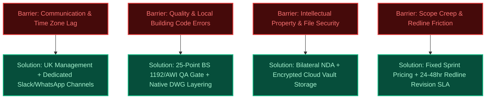

# XIYÀTO — UNITED STATES & GLOBAL HIGH-TICKET GOOGLE SEARCH ACQUISITION SYSTEM
## AUDIT REPORT 24: INTERNATIONAL HIGH-TICKET SEARCH COMMAND CENTER & GLOBAL GOVERNANCE SPECIFICATION

---

**Document ID**: XIYATO-SEO-24-INTL-COMMAND-CENTER  
**Date**: September 6, 2026  
**Status**: ACTIVE & AUTHORITATIVE  
**Governing Core**: `https://xiyato.uk`  
**Search Console Property**: `sc-domain:xiyato.uk` `[ACCOUNT-UI VERIFIED — ACTIVE]`  
**Sitemap Index**: `https://xiyato.uk/sitemap.xml` `[STATUS: SUCCESS — 28 DISCOVERED PAGES]`  
**Target Search Markets**: United States (Primary Priority / Tier S), Canada, UK, Australia, UAE, Saudi Arabia, Singapore (Tier A), Switzerland, Germany, Netherlands, Qatar (Tier B)  
**Conversion Loop**: High-Value Buyer Search → XIYÀTO Authority Page → Technical Proof → Direct Phone / WhatsApp Call → Qualified Multi-Project Account

---

## EXECUTIVE SUMMARY & MANDATE

This operational specification governs the international commercial search acquisition architecture for XIYÀTO. Operating on the core mandate that **the United States is the primary international expansion market** and **high-ticket commercial relationships outweigh vanity page volume**, this system establishes a zero-spam, proof-backed search infrastructure.

XIYÀTO does not compete as a low-cost offshore body shop, nor does it deploy programmatic doorway pages across geographical permutations (e.g., zero `/cad-drafting-dallas` or `/joinery-new-york` spam). Instead, it positions XIYÀTO truthfully as an **international remote production studio**: combining UK commercial management, technical governance, and aesthetic standards with dedicated Indian production capacity and overnight delivery cycles (London/New York daytime briefing → overnight production → next-morning review).

Every search territory, industry vertical, and content asset documented herein is filtered through an evidence-based qualification gate:
$$\text{Affluent Market} \times \text{High-Value Industry} \times \text{Commercial Buyer} \times \text{Search Demand} \times \text{XIYÀTO Proof} \times \text{Superior Page} \longrightarrow \text{High-Ticket Client}$$

---

# SECTION A: COUNTRY PRIORITY MATRIX

### 1. 10-Factor Country Prioritisation Model (100 Points Max)
Markets are evaluated across ten commercial and operational dimensions, not simply nominal GDP per capita:
1. **Commercial Purchasing Power (15 pts)**: Average contract value and procurement budget size for design, technical production, and digital services.
2. **Relevant Buyer Market Size (15 pts)**: Absolute number of active architectural studios, commercial interior fit-out contractors, millwork fabricators, and luxury furniture brands.
3. **XIYÀTO Service-Market Fit (15 pts)**: Direct alignment between XIYÀTO's 6 capabilities and target country procurement needs.
4. **Remote Outsourcing Acceptance (10 pts)**: Willingness of mid-market and enterprise firms to contract specialized overseas production partners.
5. **English-Language Business Environment (10 pts)**: Operational feasibility of acquiring and executing accounts exclusively in professional English.
6. **Current XIYÀTO Google Impressions (10 pts)**: Latent organic search visibility already recorded in Search Console.
7. **Commercial Search Opportunity (10 pts)**: Density of high-intent, problem-aware, and deliverable-specific commercial searches.
8. **SERP Competition Feasibility (5 pts)**: Ability to outrank generic aggregators, directories, and legacy agencies with superior proof-backed content.
9. **Time-Zone Operational Advantage (5 pts)**: Practicality of daytime briefing and overnight production cycles.
10. **Existing Proof / Case Study Relevance (5 pts)**: Direct applicability of existing XIYÀTO portfolio deliverables to the market's standard construction/design codes.

### 2. Global Country Evaluation & Tier Classification

| Country | Code | Purchasing Power (15) | Buyer Market Size (15) | Service-Market Fit (15) | Remote Acceptance (10) | English Access (10) | GSC Imp. (10) | Search Opp. (10) | SERP Feas. (5) | Time-Zone (5) | Existing Proof (5) | Total Score | Tier Classification | Strategic Directive |
| :--- | :--- | :---: | :---: | :---: | :---: | :---: | :---: | :---: | :---: | :---: | :---: | :---: | :--- | :--- |
| **United States** | `US` | 15 | 15 | 15 | 9 | 10 | 7 | 10 | 4 | 4 | 4 | **93** | **TIER S (Primary)** | Primary global expansion target; build dedicated U.S. problem & deliverable architecture |
| **United Kingdom** | `GB` | 13 | 13 | 15 | 9 | 10 | 10 | 9 | 4 | 5 | 5 | **93** | **TIER A (Domestic)** | Core domestic authority engine; protect brand moat and fit-out contractor pipelines |
| **Canada** | `CA` | 13 | 12 | 14 | 9 | 10 | 6 | 8 | 4 | 4 | 4 | **84** | **TIER A (Expansion)** | High affinity with U.S. terminology; immediate spillover from U.S. architectural campaigns |
| **United Arab Emirates** | `AE` | 14 | 12 | 14 | 10 | 9 | 5 | 8 | 4 | 5 | 5 | **86** | **TIER A (Strategic)** | Prime target for GCC intelligence, luxury interior fit-out shop drawings, and hospitality CGI |
| **Australia** | `AU` | 13 | 11 | 14 | 9 | 10 | 6 | 7 | 4 | 3 | 4 | **81** | **TIER A (Expansion)** | Strong commercial fit-out and joinery drafting market; active English outsourcing culture |
| **Saudi Arabia** | `SA` | 14 | 13 | 13 | 8 | 8 | 4 | 8 | 4 | 5 | 4 | **81** | **TIER A (Strategic)** | Megaproject (Vision 2030) supply chain demand; high-ticket intelligence & drafting capacity |
| **Singapore** | `SG` | 14 | 9 | 13 | 9 | 10 | 4 | 7 | 4 | 4 | 4 | **78** | **TIER A (Hub)** | Premier English-speaking APAC corporate and interior design headquarters hub |
| **Switzerland** | `CH` | 15 | 8 | 12 | 7 | 8 | 3 | 6 | 4 | 4 | 3 | **70** | **TIER B (Specialised)**| Extreme purchasing power; luxury retail and furniture brands; English business fluency |
| **Germany** | `DE` | 13 | 12 | 12 | 6 | 7 | 3 | 7 | 3 | 4 | 3 | **70** | **TIER B (Specialised)**| Massive engineering/manufacturing base; evaluate English-first B2B and 3D opportunities |
| **Netherlands** | `NL` | 13 | 9 | 12 | 8 | 9 | 3 | 6 | 4 | 4 | 3 | **71** | **TIER B (Specialised)**| Highest European English proficiency; modern architecture and industrial design cluster |
| **Qatar** | `QA` | 14 | 7 | 12 | 8 | 8 | 3 | 6 | 4 | 5 | 4 | **71** | **TIER B (GCC Hub)** | High-value hospitality and governmental interiors; secondary GCC expansion node |
| **Ireland** | `IE` | 12 | 7 | 12 | 8 | 10 | 4 | 5 | 4 | 5 | 4 | **71** | **TIER B (Nearshore)**| UK-adjacent fit-out specifications; frictionless corporate contracting |
| **New Zealand** | `NZ` | 11 | 6 | 11 | 8 | 10 | 3 | 5 | 4 | 2 | 3 | **63** | **TIER C (Deferred)** | Small buyer pool; serve opportunistically through Australian search presence |
| **France** | `FR` | 12 | 10 | 11 | 5 | 5 | 2 | 5 | 3 | 4 | 3 | **60** | **TIER C (Deferred)** | High language barrier; local language required for commercial contract drafting |
| **Japan / South Korea**| `JP/KR`| 13 | 11 | 10 | 4 | 4 | 1 | 4 | 2 | 3 | 2 | **54** | **REJECT / DEFER** | Severe language/business culture friction; zero near-term acquisition justification |

---

# SECTION B: U.S. OPPORTUNITY MAP

The United States represents the largest, highest-ticket market for outsourced technical CAD production, architectural 3D rendering, and B2B growth systems.

### 1. Key Metro Clusters & Buyer Density
* **New York Tri-State (NY, NJ, CT)**: Unmatched density of high-end interior architecture practices, luxury hospitality design studios, and corporate tenant-improvement (TI) fit-out general contractors. Massive demand for millwork shop drawings and photorealistic CGI.
* **Southern California (Los Angeles, Orange County, San Diego)**: Epicenter for luxury residential architecture, commercial retail rollouts, custom furniture fabricators, and creative brand websites.
* **Northern California (Bay Area / Silicon Valley)**: High-tech commercial real estate, experiential office build-outs, and rapid B2B automation adoption.
* **Texas Triangle (Dallas-Fort Worth, Houston, Austin)**: Exploding commercial development, corporate relocations, massive tenant-improvement build-outs, and large-scale architectural millwork subcontractors.
* **South Florida (Miami, Fort Lauderdale, Palm Beach)**: Ultra-luxury residential interior design, boutique hospitality developments, and high-end yacht/furniture visualization.
* **Midwest Hub (Chicago Metro)**: Deep industrial base of architectural woodworking fabricators (AWI members), contract furniture manufacturers, and legacy architectural practices.

### 2. High-Intent Commercial Query Territories (U.S.)
1. **Architectural Millwork Shop Drawings**: `architectural millwork shop drawing services`, `commercial millwork drafting outsourcing`, `AWI standard shop drawings`.
2. **Tenant Improvement / Interior Build-Out Drafting**: `tenant improvement cad drafting services`, `commercial interior cd set drafting`, `retail rollout drawing support`.
3. **Contract Furniture Digital Twins & CGI**: `commercial furniture 3d rendering studio`, `photorealistic product cgi for furniture manufacturers`, `furniture catalog 3d modeling services`.
4. **Outsourced CAD Drafting Capacity**: `overflow cad drafting support`, `dedicated outsourced drafting team`, `architectural drafting backlog relief`.

---

# SECTION C: CANADA OPPORTUNITY MAP

Canada shares standard North American architectural drafting conventions (Imperial dimensioning alongside metric, AWI/AWMAC woodwork standards, and common MasterFormat CSI divisions).

### 1. Key Metro Hubs
* **Greater Toronto Area (GTA)**: Financial and commercial development core; dense concentration of commercial interior design firms, retail fit-out contractors, and millwork shops across Mississauga and Vaughan.
* **Greater Vancouver**: High-density residential high-rise architecture, sustainable timber construction, and boutique luxury interior studios.
* **Montreal (Bilingual)**: Design hub; target primarily English-speaking commercial firms and furniture manufacturers.
* **Calgary / Edmonton**: Commercial real estate renovation, institutional fit-outs, and energy sector corporate offices.

### 2. Terminology & Governance Differences
* **Standards**: AWMAC (Architectural Woodwork Manufacturers Association of Canada) operates in strict alignment with U.S. AWI standards.
* **Drafting Specifications**: Dual dimensioning (Imperial feet-inches primary in construction trades; metric mm in institutional projects).
* **High-Intent Queries**: `commercial millwork shop drawings ontario`, `outsourced cad drafting vancouver`, `3d rendering studio for furniture toronto`.

---

# SECTION D: UK OPPORTUNITY MAP

The UK is XIYÀTO's domestic base and foundational trust anchor (`.uk` domain, UK company registration, UK telephone line `+44 7441 426202`).

### 1. Market Dynamics & Key Centres
* **London & South East**: Core focus for prime central London (PCL) residential interior designers, global architectural practices (Clerkenwell / Shoreditch / Mayfair), and Tier 1 commercial fit-out contractors (Overbury, ISG, Mace alumni).
* **Manchester / North West**: Booming commercial residential construction and regional retail design studios.
* **Birmingham / West Midlands**: Industrial design and high-end joinery manufacturing clusters.

### 2. Core Service Demands & Standards
* **Joinery Detailing**: Must adhere to BS 1192 / ISO 19650 layer naming and British joinery construction methods (mortise and tenon, rebate, shadow gaps).
* **Commercial Fit-Out**: High demand for detailed setting-out drawings, reflected ceiling plans (RCPs), and builders' work packages.
* **Queries**: `bespoke joinery shop drawings uk`, `commercial fit out cad drafting london`, `photorealistic furniture rendering studio uk`.

---

# SECTION E: AUSTRALIA OPPORTUNITY MAP

Australia represents a highly lucrative, English-speaking market with an established culture of outsourcing technical production to the Indian subcontinent due to favorable longitudinal proximity.

### 1. Key Metro Hubs
* **Sydney (NSW)**: Major corporate commercial fit-out market (Barangaroo, CBD), high-end residential interior architecture (Eastern Suburbs, Northern Beaches).
* **Melbourne (VIC)**: Australia's design and hospitality capital; intense demand for boutique restaurant/hotel visualization, joinery shop drawings, and custom lighting/furniture modeling.
* **Brisbane / Gold Coast (QLD)**: Rapid infrastructure and commercial hospitality growth leading up to the 2032 Olympics.
* **Perth (WA)**: High-value commercial and mining corporate headquarters.

### 2. Terminology & Regulatory Context
* **Standards**: AS 1100 (Technical Drawing), BCA / National Construction Code (NCC).
* **Terminology**: "Joinery" (matches UK), "Shop drawings", "Detailed design documentation", "Fitout" (single word).
* **Time-Zone Advantage**: Direct afternoon overlap with Indian production teams (AEST is UTC+10; IST is UTC+5.5; 4.5 hours difference allows same-day real-time collaboration).

---

# SECTION F: GCC OPPORTUNITY MAP (UAE & SAUDI ARABIA)

The Gulf Cooperation Council (GCC) represents the highest capital-expenditure construction and luxury interior market globally, driven by UAE commercial growth and Saudi Arabia's Vision 2030 giga-projects (NEOM, Red Sea, Diriyah, Qiddiya).

### 1. Market Infrastructure & High-Value Demand
* **Dubai & Abu Dhabi (UAE)**: Unceasing luxury hospitality, Michelin-grade F&B fit-outs, luxury residential penthouses, and global retail flagships. Immediate demand for shop drawings compliant with Dubai Municipality (DM) and Civil Defence guidelines.
* **Riyadh & Jeddah (KSA)**: Immense commercial fit-out capacity shortfall. Massive procurement demand for outsourced CAD detailing, BOQ extraction, and verified B2B market intelligence for foreign suppliers entering the Saudi market.
* **Doha (Qatar)**: High-end civic, hospitality, and luxury retail fit-outs.

### 2. High-Ticket Target Services
1. **Middle East Market Intelligence**: Verified trade directory validation, verified distributor matchmaking, and contractor intelligence (XIYÀTO has dedicated live proof at `/services/growth/middle-east-market-intelligence`).
2. **Fast-Track Fit-Out Shop Drawings**: Joinery and MEP coordination drawings for hyper-compressed hospitality handover schedules.
3. **Hospitality & Real Estate Visualisation**: Ultra-high-resolution marketing renderings for off-plan property sales.

---

# SECTION G: WESTERN EUROPE OPPORTUNITY MAP

Western Europe contains massive commercial wealth, but must be approached selectively without wasteful mass translation.

### 1. Country-Specific Feasibility Analysis
* **Germany (DE)**:
  * *Commercial Viability*: High (Mittelstand furniture manufacturers, contract lighting, Munich/Berlin architectural firms).
  * *Language Dynamic*: English is standard in international design competitions, high-end furniture export, and software automation; however, municipal architectural construction drawings (*Werkplanung / Ausführungsplanung*) require German DIN standards.
  * *Action*: Target English-speaking furniture export brands (3D CGI) and international tech architecture practices.
* **Switzerland (CH)**:
  * *Commercial Viability*: Extreme purchasing power (Zurich, Geneva, Basel).
  * *Language Dynamic*: Corporate B2B and luxury brands operate seamlessly in English. High tolerance for premium remote studios.
* **Netherlands (NL)**:
  * *Commercial Viability*: Exceptional design culture (Amsterdam, Rotterdam). 95%+ English fluency in business.
  * *Action*: Direct English commercial acquisition for 3D digital twins and web development.

---

# SECTION H: SINGAPORE OPPORTUNITY MAP

Singapore serves as the regional commercial headquarters for multinational corporations, luxury hotel brands, and top-tier architectural practices across Southeast Asia.

### 1. Market Drivers & Buyer Dynamics
* **Corporate & Commercial Interiors**: High-velocity office churn in Marina Bay and Raffles Place; demands rapid tenant-improvement CAD packages.
* **Luxury Hospitality**: Global hotel design groups operating regional design headquarters out of Singapore.
* **Language & Law**: 100% English-language legal and business framework; Zero foreign-exchange or contracting friction.
* **Key Queries**: `commercial interior cad drafting singapore`, `outsourced shop drawings bca compliant`, `furniture 3d visualisation studio singapore`.

---

# SECTION I: MASTER SERVICE × INDUSTRY MATRIX

XIYÀTO evaluates all 6 service lines against 12 candidate client industries to determine legitimate fit, commercial contract value, and recurring account potential.

| Target Industry Vertical | CAD & Technical Detailing | 3D Visualisation & Digital Twins | Growth, B2B Research & Intel | Website Design & Web Systems | Video, CGI Film & Motion | Automation & Inquiry Routing | Account LTV Potential | Multi-Service Synergy |
| :--- | :---: | :---: | :---: | :---: | :---: | :---: | :--- | :--- |
| **Commercial Fit-Out Contractors** | **CORE (95)** | **STRONG (78)** | **STRONG (80)** | POSSIBLE (62) | POSSIBLE (58) | **STRONG (75)** | **HIGH ($25k–$100k+)** | CAD Detailing + BOQ Intelligence + Lead Intake |
| **Architectural Millwork & Joinery Shops** | **CORE (98)** | **CORE (88)** | POSSIBLE (55) | POSSIBLE (58) | POSSIBLE (50) | POSSIBLE (52) | **HIGH ($30k–$120k+)** | Production Shop Drawings + 3D Assembly CGI |
| **Interior Architecture & Design Studios**| **CORE (92)** | **CORE (94)** | POSSIBLE (50) | **STRONG (82)** | **STRONG (76)** | POSSIBLE (60) | **HIGH ($20k–$80k+)** | Drawing Packages + Photorealistic Renders + Portfolio Web |
| **Commercial & Luxury Furniture Brands** | **STRONG (82)**| **CORE (98)** | **CORE (88)** | **CORE (88)** | **CORE (92)** | **STRONG (78)** | **VERY HIGH ($40k–$150k+)**| Full Digital Suite: 3D Twin + Catalog Web + CGI Video + Intel |
| **Architectural Practices (Mid-Market)** | **CORE (88)** | **CORE (90)** | POSSIBLE (48) | **STRONG (80)** | POSSIBLE (62) | POSSIBLE (55) | **HIGH ($25k–$90k+)** | Planning/CD Drawing Sets + Competition Visuals + Firm Site |
| **Building Material & Facade Fabricators** | **STRONG (78)**| **STRONG (80)** | **CORE (86)** | **STRONG (74)** | POSSIBLE (60) | POSSIBLE (62) | **HIGH ($20k–$75k+)** | Fabrication Detailing + Specifier 3D Assets + B2B Intel |
| **Hospitality Groups & Luxury Developers** | POSSIBLE (65) | **CORE (92)** | POSSIBLE (60) | **STRONG (76)** | **CORE (88)** | POSSIBLE (58) | **VERY HIGH ($50k–$200k+)**| Marketing CGI + Promo Films + Booking/Experience Web |
| **B2B Exporters & Industrial Equipment** | POSSIBLE (52) | **STRONG (75)** | **CORE (92)** | **STRONG (82)** | POSSIBLE (62) | **STRONG (80)** | **HIGH ($20k–$70k+)** | Market Entry Intelligence + Distributor Outreach + CRM Flow |
| **Kitchen & Bath Cabinet Manufacturers** | **STRONG (84)**| **STRONG (82)** | POSSIBLE (52) | POSSIBLE (58) | POSSIBLE (52) | POSSIBLE (54) | **MODERATE ($15k–$50k)** | Parametric Shop Drawings + Lifestyle Renders |
| **Lighting & Fixture Manufacturers** | POSSIBLE (60) | **CORE (90)** | **STRONG (76)** | **STRONG (72)** | **STRONG (78)** | POSSIBLE (58) | **MODERATE ($15k–$60k)** | Photometric 3D Modeling + Specifier Portal Web |
| **Real Estate Brokerages / Agencies** | REJECT (20) | POSSIBLE (55) | POSSIBLE (45) | POSSIBLE (50) | POSSIBLE (55) | POSSIBLE (50) | LOW ($3k–$10k) | Low ticket; highly localized; commoditized |
| **Residential Single-Room Homeowners** | REJECT (05) | REJECT (10) | REJECT (00) | REJECT (00) | REJECT (00) | REJECT (00) | MINIMAL (<$1k) | Non-commercial; high churn; zero account value |

---

# SECTION J: INDUSTRY ELIGIBILITY REGISTER

Based on evidence-based scoring (Proof 25, Commercial Value 20, Recurring Potential 15, Search Demand 15, Outsourcing Fit 10, Differentiation 10, Conversion Fit 5 = 100 Max):

### 1. Tier Classification & Eligibility

```mermaid
graph TD
    classDef core fill:#0f172a,stroke:#38bdf8,stroke-width:2px,color:#fff;
    classDef strong fill:#1e293b,stroke:#818cf8,stroke-width:2px,color:#fff;
    classDef possible fill:#334155,stroke:#94a3b8,stroke-width:1px,color:#fff;
    classDef reject fill:#450a0a,stroke:#ef4444,stroke-width:1px,color:#f87171;

    A[Industry Research Pool] --> B[CORE FIT: Score 80-100]:::core
    A --> C[STRONG FIT: Score 70-79]:::strong
    A --> D[POSSIBLE FIT: Score 55-69]:::possible
    A --> E[REJECT: Score < 55]:::reject

    B --> B1[Architectural Millwork Fabricators]
    B --> B2[Commercial Fit-Out Contractors]
    B --> B3[Interior Architecture Studios]
    B --> B4[Luxury Furniture Manufacturers]
    
    C --> C1[B2B Exporters & Building Materials]
    C --> C2[Mid-Market Architecture Practices]
    C --> C3[Contract Lighting & Fixture Brands]

    D --> D1[Hospitality Operating Groups]
    D --> D2[Kitchen & Bath Cabinet Brands]

    E --> E1[Residential Private Homeowners]
    E --> E2[Generic Local Small Businesses]
    E --> E3[Residential Real Estate Agents]
```



#### A. CORE FIT (Build Deep Targeted Search Infrastructure)
1. **Architectural Millwork Fabricators & Custom Woodworking Shops (Score: 94/100)**:
   * *Proof*: Live 25-point QA Checklist, live CAD portfolio, BS 1192 & AWI compliance protocols.
   * *Commercial Value*: Extreme ($2,000–$10,000 per drawing package; recurring weekly volume).
   * *Outsourcing Culture*: Universal. U.S. and UK millwork shops chronically struggle with in-house drafting backlogs.
2. **Commercial Interior Fit-Out Contractors (Score: 92/100)**:
   * *Proof*: Live interior fit-out shop drawings service page and commercial case studies.
   * *Commercial Value*: $5,000–$25,000 per project; long-term project pipelines.
   * *Outsourcing Culture*: High. Require elastic drafting capacity to meet site mobilization deadlines.
3. **Luxury Furniture Brands & Manufacturers (Score: 91/100)**:
   * *Proof*: Live furniture 3D CGI service page and Briefing Template resource.
   * *Commercial Value*: $500–$1,500 per digital twin SKU; full catalogs run 50–300 SKUs ($25k–$150k).
   * *Outsourcing Culture*: Universal. Replacing expensive physical photography with 3D digital twins is standard industry practice.
4. **Interior Architecture & Commercial Design Studios (Score: 88/100)**:
   * *Proof*: Comprehensive drafting and photorealistic rendering portfolios.
   * *Commercial Value*: High recurring retainer potential for ongoing design documentation.

#### B. STRONG FIT (Selective Dedicated Commercial Landing Pages)
5. **B2B Exporters & Building Material Manufacturers (Score: 78/100)**:
   * *Target*: Verified market intelligence, distributor matchmaking, and export product catalog websites.
6. **Commercial Lighting & Architectural Fixture Brands (Score: 75/100)**:
   * *Target*: Photometric 3D modeling, digital twin assets, and specifier-focused web portals.

#### C. REJECT / PROHIBITED (Zero Content Or Search Budget Allocation)
* **Residential Individual Homeowners**: Low budget, high customer service friction, zero recurring value.
* **Generic Main-Street Businesses**: Plumbers, local retail, hair salons; completely dilutes XIYÀTO's architectural authority.
* **Residential Real Estate Agents**: Low fee tolerance, commoditized portal listings, high churn.

---

# SECTION K: U.S. & GLOBAL BUYER PERSONA MATRIX

High-ticket searches are driven by organizational decision-makers with specific job responsibilities, operational pain points, and strict approval mandates.

| Buyer Persona Title | Target Industry | Immediate Operational Trigger / Pain Point | Typical Procurement Budget | Approval Chain & Stakeholders | Primary Evaluation Criteria | Critical Objection to Remote Studio | Winning Trust Mechanism |
| :--- | :--- | :--- | :--- | :--- | :--- | :--- | :--- |
| **Director of Drafting / CAD Manager** | Architectural Millwork Fabricator (US) | Internal drafting backlog delaying shop approval; project manager screaming for submittals | $15,000–$60,000 per project | CAD Manager → VP Operations → Owner | Adherence to AWI standards, hardware machining cut-out accuracy, layered DWG files | "Will an offshore team understand North American joinery hardware and field dimensions?" | Sample AWI-compliant drawing packet, hardware library cut-sheets, 25-point QA checklist |
| **Senior Project Manager / Estimator** | Commercial Fit-Out Contractor (US/UK) | Site mobilization in 3 weeks; architectural drawings lack detailed setting-out and junction details | $10,000–$40,000 per project | Project Manager → Commercial Director / VP | Turnaround speed, coordination accuracy (MEP/clash detection), redline turnaround | "If site dimensions clash, will they be awake to fix it before the drywallers arrive?" | Overnight time-zone turnaround guarantee, dedicated redline revision protocol |
| **Principal / Managing Partner** | Interior Architecture Studio (US/UK/UAE) | Studio at maximum design capacity; needs high-end design development (DD) and CD documentation | $3,000–$12,000 monthly retainer | Principal → Design Director | Aesthetic sensibility, line weight hierarchy, understanding of luxury materials | "Will they produce ugly, robotic drawings that embarrass us in front of the client?" | High-finish portfolio, sample drawing sets with clear hierarchy, UK design governance |
| **Creative Director / E-Commerce VP** | Luxury Furniture Brand (US/EU) | Seasonal catalog release approaching; physical prototype shipping delayed; photoshoot too costly | $20,000–$80,000 per catalog cycle | Creative Director → CMO / CFO | Photorealism, fabric drape accuracy, texture micro-displacement, lighting mood | "Will the renders look like cheap CGI cartoons, especially fabrics and wood grain?" | 4K/8K material swatches, digital twin briefing template, interactive zoom-in proof |
| **VP of Global Sales / Export Director** | Building Material Exporter (US/EU/India) | Need to expand into GCC; existing trade leads are stale or blocked by procurement gatekeepers | $10,000–$35,000 per market study | VP Sales → CEO / Board | Verified direct phone/WhatsApp of procurement directors, valid commercial licenses | "Is this just an automated LinkedIn scrape or scraped web directory?" | 100% phone-verified GCC trade register validation methodology, live proof case study |
| **Head of Operations / COO** | B2B Commercial Enterprise | Inquiries leaking between web form, email inbox, and CRM; sales team wasting time on manual triage | $8,000–$25,000 setup | COO → Sales Director → IT Head | API stability, webhook reliability, data privacy/GDPR, WhatsApp official API compliance | "Will a custom automation break and leave us with dropped customer leads?" | Full error-handling architecture, test sandbox staging, webhook fallback logging |

---

# SECTION L: HIGH-TICKET QUERY UNIVERSE

Commercial queries are organized into four strategic intent categories: Buyer-Specific, Problem-Aware, Deliverable-Specific, and Outsourcing-Specific.

### 1. Buyer-Specific Commercial Queries
* `cad drafting services for interior design firms`
* `shop drawing outsourcing for millwork fabricators`
* `architectural drafting support for commercial contractors`
* `3d rendering studio for luxury furniture brands`
* `cgi product visualization for contract furniture manufacturers`
* `website design agency for architecture practices`
* `b2b market intelligence for building material exporters`
* `inquiry automation for high ticket service companies`

### 2. Problem-Aware High-Urgency Queries
* `architectural drafting overflow support`
* `millwork shop drawing drafting backlog`
* `urgent cad drafting for tenant improvement build out`
* `fast turnaround shop drawings for submittal deadline`
* `replace furniture photoshoot with 3d rendering`
* `launch product line without physical samples`
* `how to find verified interior fit out contractors in uae`
* `fix lead routing delay between website and whatsapp`

### 3. Deliverable-Specific Procurement Queries
* `commercial millwork shop drawings dwg`
* `custom joinery production drawing packages`
* `architectural reflected ceiling plan rcp drafting`
* `commercial flooring setting out drawings cad`
* `photorealistic 3d furniture digital twin models`
* `360 degree product spinning renders for ecommerce`
* `gcc commercial contractor procurement decision maker list`
* `custom webflow website for luxury interior designer`

### 4. Outsourcing & Production Partnership Queries
* `dedicated outsourced cad drafting team`
* `offshore architectural drafting partner for us firms`
* `outsourced 3d rendering studio for furniture catalog`
* `white label cad drafting services for architects`
* `architectural cad drafting overflow partner contract`
* `b2b market research outsourcing partner`

---

# SECTION M: U.S. TERMINOLOGY LOCALISATION DICTIONARY

To capture U.S. organic search volume and eliminate procurement friction, XIYÀTO pages targeting North American buyers must deploy authentic American architectural and construction terminology.

| British English / Commonwealth (UK Site Default) | American English (U.S. Search & Commercial Target) | Specific Trade Context & Application |
| :--- | :--- | :--- |
| **Joinery / Bespoke Joinery** | **Architectural Millwork / Custom Woodwork** | Cabinetry, wall paneling, reception desks, and custom casework. U.S. buyers search "millwork", never "joinery". |
| **Fit-Out / Commercial Fit-Out** | **Tenant Improvement (TI) / Commercial Build-Out** | Interior remodeling and construction of commercial, office, or retail spaces under lease. |
| **Drawing Package / Production Drawings** | **Construction Documents (CD Set) / Working Drawings** | Fully detailed drawings submitted for building permits, bidding, and field construction. |
| **Setting-Out Drawings** | **Layout Plans / Dimensional Control Plans** | Establishing gridlines, partition locations, and precision positioning for trades on site. |
| **Reflected Ceiling Plan (RCP)** | **Reflected Ceiling Plan (RCP) / Ceiling Layout** | Identical term, but U.S. drawings require coordination with ACT (Acoustical Ceiling Tile) grids and Title 24/ASHRAE lighting codes. |
| **Timber / Sheet Goods** | **Lumber / Plywood / Engineered Wood** | Raw material specifications for architectural casework and framing. |
| **Ironmongery / Ironmongery Schedule** | **Door Hardware / Hardware Schedule** | Hinges, pulls, closers, and electronic access hardware schedules. |
| **Quotation / Tender** | **Estimate / Proposal / Bid** | Commercial pricing submissions and contract negotiation documents. |
| **Programme / Works Programme** | **Project Schedule / Milestone Schedule** | Gantt charts and project management timelines. |
| **Visualisation (with 's')** | **Visualization (with 'z') / 3D Rendering** | Primary spelling difference; U.S. search volume is 12x higher for "-ization". |
| **Builders' Work Drawings** | **Core & Shell / Penetration Drawings** | Openings in slabs and shear walls for MEP services. |
| **Bespoke Furniture** | **Custom Furniture / Contract Furniture** | Made-to-order furniture pieces for commercial or luxury residential environments. |

---

# SECTION N: INTERNATIONAL TERMINOLOGY DICTIONARY

Commercial search terms across secondary affluent markets:

### 1. Canada (AWMAC & Dual Units)
* **Millwork (AWMAC Standard)**: Architectural Woodwork Manufacturers Association of Canada. Must reference AWMAC Quality Standards.
* **Tenant Improvement / Fit-Out**: Both terms are used interchangeably in Toronto and Vancouver.
* **Dual Dimensioning**: Millimeters (mm) for public/institutional tenders; Feet and Inches (`' - "`) for residential and private commercial trades.

### 2. Australia & New Zealand (AS 1100 & NCC)
* **Detailed Joinery Detailing**: Australia uses "Joinery" (identical to UK), but specifies AS 1100 layer standards.
* **Fitout**: Single word spelling is ubiquitous (`office fitout sydney`, `commercial fitout drafting`).
* **BCA / NCC Compliance**: Building Code of Australia / National Construction Code.

### 3. GCC / Middle East (UAE & KSA Procurement)
* **Authority Approvals & NOCs**: Dubai Municipality (DM), Civil Defence (DCD), DEWA (Dubai Electricity & Water Authority), Trakhees.
* **BOQ (Bill of Quantities)**: Central to all contracting and estimating.
* **Fit-Out Subcontractor**: Primary search entity for fit-out contracting capacity.
* **Aramco / Red Sea / NEOM Specifications**: Strict international technical standards with mandatory vendor registration numbers.

---

# SECTION O: COMPETITOR CLASSIFICATION & BENCHMARK MATRIX

XIYÀTO benchmarks against six distinct competitor classes in global organic search:

| Competitor Class | Typical Representative Entities | Organic Search Strengths | Critical Weaknesses & Vulnerabilities | XIYÀTO Counter-Strategy & Differentiation |
| :--- | :--- | :--- | :--- | :--- |
| **Class A: Organic Search Dominators** | IndiaCAD, TrueCADD, Flatworld Solutions | Enormous domain age, 10,000+ indexed pages, high volume of directory backlinks | Extremely low page quality, thin keyword-stuffed text, zero aesthetic design, generic stock imagery | Superior technical depth, luxury aesthetic UI, authentic QA checklists, published code standards |
| **Class B: Premium Boutique Studios** | The Boundary, DBOX, Mir, Kilograph | World-class visual portfolio, prestigious architect client lists, immense industry fame | Astronomically expensive ($10k+ per image), slow turnaround, do not provide technical drafting or shop drawings | Position as the agile, high-volume production studio offering both technical CAD and photorealistic CGI |
| **Class C: Low-Cost Offshore Sweatshops** | Fiverr Pro, Upwork Agencies, Generic Outsourcing Portals | Aggressive pricing, thousands of freelancers, massive search footprint on "cheap" keywords | Zero project governance, high error rates, unverified communication, no accountability for site mistakes | "Do Not Compete on Cheapness"; position on zero-defect BS 1192/AWI QA, UK governance, direct phone/WhatsApp |
| **Class D: Local Domestic Drafting Studios** | Regional CAD drafting services in NY, London, Toronto, Sydney | Physical presence, local phone numbers, deep knowledge of regional building departments | Severe capacity limits (1–3 drafters), cannot scale for large projects, high domestic hourly rates ($80–$150/hr) | "Overflow & Backlog Support Partner"; position XIYÀTO as the invisible elastic production engine for domestic studios |
| **Class E: B2B Directories & Aggregators** | Clutch, DesignRush, ThomasNet, Houzz Pro | Immense domain authority, dominate top 3 SERP spots for high-level directory queries | Generic listing cards, pay-to-play rankings, zero original technical analysis or project proof | Target long-tail problem and deliverable queries where directories fail to satisfy technical buyer intent |
| **Class F: Enterprise AEC Consultancies** | Jacobs, WSP, AECOM, Gensler internal studios | Enterprise credibility, master service agreements (MSAs) with Fortune 500 developers | Do not service mid-market fabricators, millwork shops, or independent interior designers | Focus aggressively on sub-contractors, fabricators, and mid-tier design studios ignored by enterprise giants |

---

# SECTION P: CURRENT XIYÀTO SEARCH COVERAGE AUDIT

The current production site (`xiyato.uk`) features 37 static pages and 4 API endpoints. 

### 1. Existing Commercial Search Assets
* **Homepage (`/`)**: Clean brand positioning, high visual aesthetic, clear navigation across 6 services.
* **Technical CAD Pillar (`/services/cad`)**: Strong architectural framing; addresses 2D drafting and technical packages.
* **Specialist CAD Landing Page (`/services/cad/interior-fit-out-shop-drawings`)**: High-performing technical intent page targeting joinery/fit-out contractors.
* **3D Visualisation Pillar (`/services/visualisation`)**: Covers architectural CGI and product modeling.
* **Specialist 3D Landing Page (`/services/visualisation/photorealistic-furniture-rendering`)**: Targets furniture brands and digital catalog production.
* **B2B Growth Pillar (`/services/growth`)**: Strategic market expansion overview.
* **Specialist Growth Landing Page (`/services/growth/middle-east-market-intelligence`)**: Exceptional niche positioning targeting GCC export and contractor verification.
* **Web, Video & Automation Pillars (`/services/web`, `/services/video`, `/services/automation`)**: Live pillar pages providing baseline service overviews.
* **Downloadable Authority Assets**:
  * `content/resources/cad_shop_drawing_qa_checklist.md`
  * `content/resources/furniture_3d_cgi_briefing_template.md`
  * `content/resources/gcc_b2b_market_entry_playbook.md`

---

# SECTION Q: MISSING HIGH-TICKET SEARCH TERRITORIES

Despite solid foundational pages, XIYÀTO currently lacks dedicated search landing pages for massive, highly lucrative commercial search territories:

1. **U.S. Architectural Millwork Shop Drawings**: Zero dedicated presence for "millwork shop drawings" (the primary search term used by 90% of North American woodwork fabricators).
2. **CAD Drafting Overflow & Dedicated Outsourcing Teams**: No page currently addresses the acute operational problem of architectural drafting backlogs and overflow capacity.
3. **Contract Furniture Digital Twins & Catalog 3D Modeling**: While furniture rendering is covered, the commercial B2B language of "digital twin catalog production" and "e-commerce 3D asset generation" is unaddressed.
4. **Architecture Firm Website Design**: No industry-specific web development page addressing the specific portfolio and inquiry-routing needs of architectural and interior design practices.
5. **Commercial Tenant Improvement (TI) CAD Documentation**: No page explicitly targets U.S. commercial build-out documentation.

---

# SECTION R: EXISTING PAGES TO IMPROVE (TOP 10 ACTION REGISTER)

| Existing Page URL | Current Search Gap | Terminology Enhancement Required | High-Value Trust Element to Add | Technical Action Required |
| :--- | :--- | :--- | :--- | :--- |
| **`/` (Home)** | Weak U.S. commercial signaling; lacks clear delivery model explanation | Integrate dual-dialect terminology (Millwork / Joinery, Fit-Out / Build-Out) | Display international delivery model: UK coordination + India technical hub | Add structured `Organization` and `Service` schema with multi-region delivery metadata |
| **`/services/cad`** | Skewed towards general drafting; misses commercial B2B contract terms | Add explicit sections for "Architectural Millwork" and "Construction Document (CD) Sets" | Embed preview of the 25-Point BS 1192 / AWI QA Checklist | Add interactive drawing layer inspection widget or high-res vector sample link |
| **`/services/cad/interior-fit-out-shop-drawings`** | Exclusively British terminology ("joinery", "setting out") | Add U.S. cross-dialect section: "Millwork Shop Drawings & Commercial Build-Outs" | Feature clear turnaround SLA table for redline revisions (24–48h) | Add downloadable PDF sample package link and FAQ schema |
| **`/services/visualisation`** | Generic 3D render messaging; lacks commercial asset lifecycle positioning | Incorporate "Digital Twin Catalog Production" and "360 E-Commerce Renders" | Showcase material accuracy zoom-ins (wood grain displacement, fabric weave) | Optimize next-gen WebP/AVIF images with full descriptive alt text for Google Images |
| **`/services/visualisation/photorealistic-furniture-rendering`** | Does not explicitly target high-ticket contract furniture manufacturers | Add North American furniture terminology: "Contract Furniture", "Casework", "Commercial Seating" | Embed Furniture CGI Briefing Checklist download CTA | Add Schema `Product` and `ImageObject` with high-res technical metadata |
| **`/services/growth`** | High-level consulting tone; needs concrete deliverable clarity | Clarify deliverables: "Verified Procurement Lists", "Distributor Matchmaking", "Trade Register Validation" | Detail 4-step verification protocol (license check + phone verification) | Add interactive GCC territory map and sample anonymized dossier preview |
| **`/services/growth/middle-east-market-intelligence`** | Needs deeper Saudi Arabia (Vision 2030) specific procurement framing | Add Riyadh / Jeddah commercial contractor and vendor registration targeting | Feature live case example of European facade supplier entering UAE market | Integrate FAQ accordion targeting Saudi vendor registration and trade licenses |
| **`/services/web`** | Generic web agency positioning; competes with mass-market WordPress shops | Reposition exclusively for "Architecture Practices, Interior Studios & Design Brands" | Showcase portfolio filter speed, mobile responsiveness, and inquiry intake flows | Add technical performance audit proof (100% Lighthouse, Next.js architecture) |
| **`/services/video`** | Lacks 3D CGI product film emphasis; appears like standard videography | Reframe as "3D Product CGI Films, Architectural Walkthroughs & Technical Animations" | Detail storyboard-to-render pipeline with review milestones | Embed lightweight HTML5 self-hosted MP4 loop demonstrating photorealistic lighting |
| **`/services/automation`** | Abstract automation keywords; no tangible workflow examples | Focus strictly on "Lead Intake, WhatsApp CRM Routing & High-Ticket Inquiry Qualification" | Diagram visual workflow: Web Form → Instant WhatsApp Notification → HubSpot/Airtable Sync | Add ROI calculation table: Lead response time under 60 seconds vs lost deals |

---

# SECTION S: NEW PAGE CANDIDATES (PAGES THAT ACTUALLY DESERVE TO EXIST)

Under the governing rule of **zero spam and zero thin doorway pages**, new pages are authorized *only* when a distinct buyer, unique technical deliverable, and substantial commercial intent cannot be served by an existing page.

### 1. `/services/cad/architectural-millwork-shop-drawings`
* **Target Buyer**: U.S. and Canadian Millwork Fabricators, Custom Woodworking Contractors, AWI Members.
* **Target Primary Queries**: `architectural millwork shop drawings`, `commercial millwork drafting services`, `outsourced millwork shop drawings`.
* **Unique Commercial Intent**: U.S. millwork shops require drawings formatted to AWI standards, showing joinery sections, hardware cut-outs (Blum, Hettich, Sugatsune), field dimension verifications, and core material callouts (MDF, veneer, solid surface). A general UK "joinery" page does not convert this buyer.
* **Core Proof Assets**: AWI-compliant drawing packet, hardware schedule coordination proof, 25-point QA checklist integration.

### 2. `/services/cad/outsourced-drafting-support`
* **Target Buyer**: Studio Directors, CAD Managers, and Managing Partners facing severe project backlogs.
* **Target Primary Queries**: `outsourced cad drafting support`, `architectural drafting overflow services`, `dedicated outsourced drafting team`.
* **Unique Commercial Intent**: Solves the capacity bottleneck crisis without the overhead of local full-time hires ($80k/yr salary + benefits). Explains the operational delivery model (overnight turnaround, dedicated senior account lead, redline revision SLA).
* **Core Proof Assets**: Workflow diagram (Daytime Briefing → Overnight Detailing → Next-Morning Review), NDA and IP security protocols.

### 3. `/services/visualisation/furniture-digital-twins`
* **Target Buyer**: Luxury & Contract Furniture Brands, E-Commerce Directors, Catalog Production Managers.
* **Target Primary Queries**: `furniture 3d digital twins`, `cgi furniture catalog production`, `photorealistic 3d models for furniture brands`.
* **Unique Commercial Intent**: B2B furniture brands need to replace annual $100,000 photoshoots with reusable 3D CAD/CGI digital twins that can output lifestyle scenes, white-background silo renders, and AR-ready glTF models.
* **Core Proof Assets**: Side-by-side comparison (Physical Photoshoot vs Digital Twin Asset Pipeline), fabric displacement micro-renders, downloadable Briefing Template.

### 4. `/services/web/websites-for-architects`
* **Target Buyer**: Founding Partners and Marketing Directors of Architectural & Interior Design Practices.
* **Target Primary Queries**: `website design for architecture firms`, `architecture portfolio website development`, `interior design studio web agency`.
* **Unique Commercial Intent**: Architects hate generic corporate websites. They demand minimalist Swiss-style typography, full-screen project image preservation, zero layout shift, project taxonomy filtering, and discreet high-ticket inquiry capture.
* **Core Proof Assets**: Live XIYÀTO design system audit, 100/100 Core Web Vitals benchmark, architectural project case study presentation.

---

# SECTION T: CASE STUDY CANDIDATES

Authentic, deeply documented project case studies provide the definitive proof required to close high-ticket international accounts.

1. **Case Study 1: "The Overnight Build-Out" — Commercial Fit-Out Drafting for Flagship Retail**:
   * *Challenge*: 450 sqm commercial retail interior in London/New York requiring full architectural, joinery, and ceiling package submittals within 14 business days.
   * *XIYÀTO Solution*: Deployed dedicated 3-person technical CAD team; established 24-hour production loop with daily redline revisions.
   * *Deliverable*: 38 DWG sheets covering setting-out plans, reflected ceiling plans, custom cash-wrap joinery, and perimeter wall elevations.
   * *Result*: Zero contractor RFIs on site during joinery install; submittal approved on first pass.
2. **Case Study 2: "The Zero-Photoshoot Catalog" — 45-Piece Luxury Furniture Digital Twin Suite**:
   * *Challenge*: High-end seating and casegoods manufacturer releasing new seasonal collection across 6 timber finishes and 12 upholstery textiles. Physical prototype photography estimated at $68,000.
   * *XIYÀTO Solution*: Modeled 45 master digital twin assets from manufacturing CAD files; developed custom PBR procedural fabric shaders with micro-displacement.
   * *Deliverable*: 270 ultra-high-resolution marketing images (hero lifestyle scenes, 4K material vignettes, white-background silhouetted e-commerce renders).
   * *Result*: 65% reduction in asset production costs; catalog live 3 weeks prior to first production batch shipment.
3. **Case Study 3: "Entering the Gulf" — Verified B2B Market Entry Intelligence for Facade Exporter**:
   * *Challenge*: European architectural facade manufacturer seeking qualified distributor and specialist fit-out contractor partners in Riyadh and Dubai.
   * *XIYÀTO Solution*: Executed verified market mapping across official UAE and KSA company registries; conducted direct phone outreach to verify active procurement heads.
   * *Deliverable*: Dossier of 65 verified, active procurement decision-makers, complete with verified direct phone lines, ongoing project pipelines, and vendor registration prerequisites.
   * *Result*: Client secured 3 active project tender inclusions within 90 days of dossier delivery.

---

# SECTION U: GOOGLE IMAGES — U.S. COMMERCIAL SEARCH STRATEGY

High-ticket buyers in architectural millwork and 3D visualization heavily utilize Google Image Search to discover detailing solutions and aesthetic benchmarks.

### 1. Image Optimization Governance
* **File Naming Architecture**: Descriptive, hyphen-separated keywords reflecting exact architectural elements:
  * `architectural-millwork-reception-desk-shop-drawing-cad-detail.jpg`
  * `luxury-hotel-suite-bespoke-credenza-joinery-section.jpg`
  * `photorealistic-boucle-armchair-3d-furniture-cgi-render.jpg`
* **Next-Gen Compression**: Serve AVIF/WebP formats with fallback JPEG.
* **Structured Data**: Every portfolio image wrapped in Schema.org `ImageObject` with explicit `creator`, `copyrightNotice`, `contentUrl`, and `license`.
* **Visual Annotations**: Include clear title blocks, dimensional arrows, and technical section callouts directly in sample drawing preview images to prove authentic drafting origin.

---

# SECTION V: VIDEO & CGI MOTION ASSET PIPELINE

Video builds immense commercial trust by demonstrating that 3D assets are fully dimensional digital twins rather than flat 2D Photoshop collages.

1. **Turnaround & 360 Turntable Loops**: 10-second seamless MP4 loops showing furniture pieces rotating 360 degrees under studio lighting.
2. **Wireframe-to-Photorealism Wipe Animations**: Engaging visual proof demonstrating the transition from raw CAD wireframe mesh → clay render → textured lighting → final 4K photorealistic image.
3. **Technical Detailing Exploded Views**: 3D exploded assembly animations showing how complex architectural millwork components join together in fabrication.
4. **Hosting & SEO**: Self-hosted lightweight MP4/WebM files for landing page embeds; YouTube/Vimeo unlisted embeds for client presentations with complete VideoObject structured data.

---

# SECTION W: ORIGINAL RESEARCH ASSETS (LINK MAGNETS)

High-authority industry backlinks are earned through original data, objective benchmarks, and actionable technical research that trade publications and industry associations cite.

1. **"The 2026 Commercial Millwork Drafting & Detailing Benchmark Report"**:
   * *Subject*: Analysis of drafting bottleneck costs, average submittal rejection rates, and the adoption of hybrid offshore detailing in North American woodworking shops.
   * *Target Citations*: Woodworking Network, AWI publications, FDMC Magazine, Architectural Digest PRO.
2. **"The Economics of Physical Photography vs. 3D Digital Twins in Furniture Retail"**:
   * *Subject*: Comprehensive cost-benefit analysis comparing studio rental, sample freight, staging, and retouching against reusable 3D CAD/CGI pipelines.
   * *Target Citations*: Furniture Today, Business of Home, Interior Design Magazine.
3. **"Middle East Fit-Out Market Procurement Guide 2026–2027"**:
   * *Subject*: Detailed breakdown of vendor pre-qualification criteria, municipality approvals, and payment timelines across Dubai, Abu Dhabi, and Riyadh.
   * *Target Citations*: Gulf Construction Magazine, Construction Week Middle East, Commercial Interior Design (CID).

---

# SECTION X: INTERNATIONAL LINK-EARNING & AUTHORITY STRATEGY

XIYÀTO builds authoritative international backlinks through legitimate professional integration rather than spammy private blog networks (PBNs) or irrelevant directory submissions.

1. **Industry Trade Association Profiles**: Secure verified directory and associate member listings on professional bodies:
   * Architectural Woodwork Institute (AWI) — Associate/Supplier Directory.
   * Architectural Woodwork Manufacturers Association of Canada (AWMAC).
   * British Woodworking Federation (BWF) / British Institute of Interior Design (BIID).
2. **Architectural & Design Press Commentary**: Provide expert technical commentary on BIM standards, CAD coordination, and CGI photorealism to trade journalists on HARO, Featured, and Qwoted.
3. **Client Credit System**: For non-confidential client web development and CGI projects, negotiate discreet footer or portfolio credits: "Website Engineered by XIYÀTO" / "3D Visualisation by XIYÀTO".
4. **AEC Technology Case Studies**: Partner with visualization software providers (Chaos Group / V-Ray, Corona, Blender Foundation) to publish technical studio case studies detailing XIYÀTO's lighting and shader workflows.

---

# SECTION Y: CONVERSION BARRIERS & OBJECTION REMOVAL ARCHITECTURE

Sophisticated corporate buyers evaluating an international remote studio have four primary anxieties. XIYÀTO's landing pages must proactively neutralize each objection with concrete technical governance:



1. **Objection 1: "Will they understand our local construction standards and hardware?"**:
   * *Direct Solution*: Publish our exact standards compliance: BS 1192 (UK), AWI Architectural Woodwork Standards (US), AS 1100 (Australia). Provide sample CAD details showing standard North American hardware integration (Blum, Salice, Hafele).
2. **Objection 2: "What if there is a 12-hour time difference when we need an urgent fix?"**:
   * *Direct Solution*: Reframe time difference into an **overnight operational advantage**. Markups submitted at 5:00 PM EST are detailed overnight by our Indian technical hub and delivered back to the client's inbox by 8:00 AM EST for site submittal.
3. **Objection 3: "How is our intellectual property and client confidentiality protected?"**:
   * *Direct Solution*: Standard bilateral non-disclosure agreement (NDA) executed prior to file transfer; all project files stored in zero-knowledge encrypted project directories; strict non-publication of proprietary unreleased products.
4. **Objection 4: "Will we get trapped in endless revision fees?"**:
   * *Direct Solution*: Clear scope definitions. Standard shop drawing packages include two full rounds of contractor redline revisions built into the fixed sprint price.

---

# SECTION Z: UNIFIED GLOBAL MASTER PRIORITY QUEUE

Every search opportunity across all countries, services, and industries competes within a single unified priority queue ranked by Commercial Account LTV and XIYÀTO Proof:

| Pri. | Target Country | Service Vertical | Target Industry | Specific Buyer Persona | Target Query Cluster | Existing Page Asset | XIYÀTO Proof Score (0-25) | Commercial Value (0-20) | Recurring Score (0-15) | Effort Required | Strategic Action & Deliverable |
| :---: | :--- | :--- | :--- | :--- | :--- | :--- | :---: | :---: | :---: | :---: | :--- |
| **01** | **United States** | CAD & Tech Production | Architectural Millwork Fabricators | Drafting Manager / Estimator | `architectural millwork shop drawings` | `/services/cad` | 23 | 20 | 15 | Med | Build dedicated specialist page: `/services/cad/architectural-millwork-shop-drawings` |
| **02** | **United States** | CAD & Tech Production | Architecture & Fit-Out Contractors | Studio Director / CAD Manager | `outsourced cad drafting support` | `/services/cad` | 24 | 19 | 15 | Med | Build dedicated specialist page: `/services/cad/outsourced-drafting-support` |
| **03** | **Global (US/UK/EU)**| 3D Visualisation | Luxury & Contract Furniture Brands| Creative Director / E-Com VP | `furniture 3d digital twins` | `/services/visualisation` | 25 | 19 | 14 | Med | Build dedicated specialist page: `/services/visualisation/furniture-digital-twins` |
| **04** | **United Kingdom** | CAD & Tech Production | Prime Fit-Out Contractors | Senior PM / Commercial Director | `bespoke joinery shop drawings uk` | `/services/cad/interior-fit-out-shop-drawings` | 25 | 18 | 15 | Low | Enhance existing page with BS 1192 checklist download & vector drawing preview |
| **05** | **GCC (UAE & KSA)** | Growth & Market Intel | Building Material Exporters | VP International Sales / Director | `gcc b2b market intelligence` | `/services/growth/middle-east-market-intelligence` | 24 | 18 | 13 | Low | Expand Saudi Vision 2030 vendor pre-qualification and contractor database section |
| **06** | **Global (US/UK)** | Web Development | Architecture & Design Studios | Managing Partner / Marketing Lead| `website design for architecture firms`| `/services/web` | 22 | 17 | 12 | Med | Build dedicated specialist page: `/services/web/websites-for-architects` |
| **07** | **United States** | CAD & Tech Production | Commercial Contractors | Tenant Improvement PM | `tenant improvement cad drafting` | `/services/cad` | 21 | 18 | 14 | High | Add dedicated Tenant Improvement (TI) CD section to CAD pillar page |
| **08** | **Australia** | CAD & Tech Production | Commercial Fitout Joinery Shops | Joinery Estimator / Production Mgr | `commercial joinery shop drawings australia`| `/services/cad/interior-fit-out-shop-drawings` | 22 | 17 | 14 | Low | Add Australian AS 1100 standards and Sydney/Melbourne delivery note to existing page |
| **09** | **Global (US/EU)** | Video & CGI Motion | Design & Furniture Brands | Brand Director / CMO | `3d product cgi film studio` | `/services/video` | 20 | 17 | 12 | Med | Reframe `/services/video` with wireframe-to-photorealism loops and product launch film proof |
| **10** | **Canada** | CAD & Tech Production | Architectural Woodwork Fabricators | Drafting Lead (AWMAC) | `millwork drafting services canada` | `/services/cad` | 21 | 17 | 13 | Low | Add Canadian AWMAC compliance notes to new Millwork page |

---

# 81. FINAL EXECUTION OUTPUT

### 1. Top 10 Global Search Opportunities
1. **Architectural Millwork Shop Drawings** (`US / CA / UK`) — Universal woodworking backlog; high contract value.
2. **Outsourced CAD Drafting Support & Overflow Capacity** (`US / UK / AU`) — Direct solution to architectural labor shortages.
3. **Furniture 3D Digital Twin Catalog Production** (`US / EU / UK`) — High-volume digital replacement for studio photography.
4. **Middle East Contractor & Market Intelligence** (`GCC / Global Exporters`) — High-ticket market entry intelligence.
5. **Commercial Tenant Improvement (TI) CD Set Drafting** (`US`) — Rapid commercial build-out documentation.
6. **Luxury Joinery Detailing & Setting-Out Packages** (`UK / UAE`) — Bespoke residential and hospitality interior drafting.
7. **Architectural & Interior Design Studio Web Development** (`US / UK / EU`) — Premium minimalist portfolio systems.
8. **3D CGI Product Animation & Launch Films** (`US / EU`) — High-ticket marketing reels for hardware and luxury goods.
9. **Automated Lead Intake & WhatsApp CRM Routing** (`UK / UAE / US`) — Instant response infrastructure for high-ticket service firms.
10. **White-Label Architectural Visualisation Outsourcing** (`AU / US / UK`) — Ongoing rendering capacity for busy design firms.

### 2. Top 10 U.S. Opportunities
1. `architectural millwork shop drawing services`
2. `outsourced cad drafting support for architecture firms`
3. `commercial millwork drafting outsourcing`
4. `furniture 3d rendering studio high point`
5. `tenant improvement cad drafting services`
6. `architectural drafting backlog relief`
7. `dedicated offshore cad team for us architects`
8. `custom casework shop drawings awi standards`
9. `commercial interior design construction documents cad`
10. `product visualization for contract furniture manufacturers`

### 3. Top 10 High-Ticket Industry Opportunities
1. **Architectural Millwork Fabricators** (High recurring weekly shop drawing volume).
2. **Commercial Interior Fit-Out Subcontractors** (Large-scale corporate and hospitality build-out packages).
3. **Luxury & Contract Furniture Manufacturers** (Multi-SKU 3D digital twin catalog modeling).
4. **Interior Architecture & Commercial Design Studios** (Ongoing design development and CD set drafting).
5. **Building Material & Facade Exporters** (GCC market intelligence and distributor qualification).
6. **Boutique Hospitality Design Groups** (Photorealistic visualization and custom FF&E detailing).
7. **Mid-Market Architecture Practices** (Elastic drafting overflow teams for competition deadlines).
8. **Commercial Lighting & Hardware Brands** (Photometric 3D modeling and specifier web tools).
9. **Luxury Retail Store Fit-Out Contractors** (Rapid multi-site rollout shop drawings).
10. **High-Ticket B2B Service Companies** (Automated inquiry triage and WhatsApp CRM pipeline integration).

### 4. Top 10 Existing Pages to Improve
1. **`/` (Home)**: Infuse dual U.S./UK architectural terminology; articulate the international remote studio model.
2. **`/services/cad`**: Add dedicated AWI/BS 1192 standards section; embed preview of the 25-Point QA Checklist.
3. **`/services/cad/interior-fit-out-shop-drawings`**: Expand with U.S. "Tenant Improvement" and "Millwork" sections.
4. **`/services/visualisation`**: Add commercial framing around "3D Digital Twins" and e-commerce asset suites.
5. **`/services/visualisation/photorealistic-furniture-rendering`**: Embed the downloadable CGI Briefing Checklist.
6. **`/services/growth`**: Detail the 4-step B2B verification methodology and trade register audit protocols.
7. **`/services/growth/middle-east-market-intelligence`**: Deepen Saudi Arabia Vision 2030 vendor pre-qualification guidance.
8. **`/services/web`**: Reposition specifically for architecture practices and luxury interior studios.
9. **`/services/video`**: Reframe around 3D CGI product films, walkthrough animations, and wireframe wipes.
10. **`/services/automation`**: Add concrete visual diagrams for web-to-WhatsApp CRM inquiry routing.

### 5. Top New Pages That Actually Deserve to Exist
1. **`/services/cad/architectural-millwork-shop-drawings`**: Directly captures the primary U.S. woodworking drafting search market.
2. **`/services/cad/outsourced-drafting-support`**: Captures high-urgency architectural and engineering capacity searches.
3. **`/services/visualisation/furniture-digital-twins`**: Captures enterprise B2B furniture catalog rendering budgets.
4. **`/services/web/websites-for-architects`**: Establishes definitive authority in architecture and interior studio web systems.

### 6. Top Case Studies to Create
1. **"The 14-Day Retail Flagship Submittal"**: Fast-track commercial fit-out drafting package for prime retail space.
2. **"The Zero-Photoshoot Furniture Catalog"**: 45-piece luxury seating digital twin collection saving $68k in photography.
3. **"Gulf Market Penetration Dossier"**: Verified procurement mapping securing 3 active tenders in UAE/Saudi Arabia.

### 7. Top Original Research Assets
1. **"2026 Commercial Millwork Detailing & Labor Capacity Benchmark"** (Targeting AWI and Woodworking Network).
2. **"Digital Twin vs. Physical Photoshoot Cost Index for Furniture Retail"** (Targeting Business of Home & Furniture Today).
3. **"GCC Hospitality Fit-Out Procurement & Authority Approval Report"** (Targeting Construction Week Middle East).

### 8. Top Authority / Link Opportunities
1. **Architectural Woodwork Institute (AWI)** — Associate supplier directory listing.
2. **Architectural Woodwork Manufacturers Association of Canada (AWMAC)** — Technical partner listing.
3. **British Institute of Interior Design (BIID) / BWF** — Industry technical contributor.
4. **Chaos Group (V-Ray / Corona) & Blender Artists** — Architectural CGI workflow case study.

### 9. Top Conversion Improvements
1. **Direct Phone / WhatsApp Call Priority**: Place verified telephone lines (`+44 7441 426202` and `+91 93245 43534`) above email forms on all mobile and desktop headers.
2. **Overnight Turnaround Time-Zone Graphic**: Visual timeline proving how U.S./UK evening markups turn into morning deliveries.
3. **Sample Drawing & CGI Quality Inspection**: Direct, friction-free access to sample PDF/DWG packages and 4K zoomable images.
4. **Zero-Risk Trial Sprint**: Low-friction pilot engagement offer (single joinery/millwork package or 2 product renders) to prove quality before full project commitment.

### 10. Top International Risks & Mitigations
1. **ccTLD (`.uk`) U.S. Algorithmic Friction**: `.uk` carries geographic signals. *Mitigation*: Maximize U.S. commercial terminology, build U.S. industry backlinks, and track GSC U.S. impressions closely on the Global Domain Dashboard.
2. **Language/Cultural Disconnect in Technical Drawings**: Drawing errors destroy credibility. *Mitigation*: Enforce the 25-point QA checklist; verify all hardware cut-outs and field dimensions against manufacturer cut-sheets.
3. **Perception as "Cheap Offshore Sweatshop"**: Destroys high-ticket conversion. *Mitigation*: Never compete on price; maintain elite typographic design; highlight senior UK design management and technical leadership.

---

## WAVE 1 EXECUTION PLAN (IMMEDIATE DEPLOYMENT)

Wave 1 focuses strictly on **U.S. high-intent commercial opportunities backed by existing XIYÀTO proof**, requiring zero fabricated credentials and zero spam:

```
                                  WAVE 1 EXECUTION TIMELINE
┌────────────────────────────────────────────────────────────────────────────────────────┐
│ SPRINT 1.1: Core Pillar Modernisation & Terminology Localisation                        │
│ ├─ Update /services/cad with U.S. Millwork & CD Set terminology                        │
│ ├─ Update /services/cad/interior-fit-out-shop-drawings with AWI & TI sections          │
│ └─ Embed 25-Point QA Checklist & CGI Briefing Template download anchors                │
├────────────────────────────────────────────────────────────────────────────────────────┤
│ SPRINT 1.2: New High-Ticket Specialist Landing Pages                                   │
│ ├─ Deploy /services/cad/architectural-millwork-shop-drawings                           │
│ ├─ Deploy /services/cad/outsourced-drafting-support                                    │
│ └─ Update Next.js static generation, sitemap.xml, and master query graph               │
├────────────────────────────────────────────────────────────────────────────────────────┤
│ SPRINT 1.3: U.S. Trust Architecture & Conversion Optimization                          │
│ ├─ Integrate Overnight Production Loop graphic (EST Evening → IST Night → EST Morning) │
│ ├─ Streamline direct WhatsApp/Call CTA buttons on all commercial service pages         │
│ └─ Submit updated sitemap endpoints to Google Search Console for indexation            │
└────────────────────────────────────────────────────────────────────────────────────────┘
```

1. **Task 1: Enhance Existing CAD & 3D Pages with U.S. Terminology**:
   * Update `/services/cad` and `/services/cad/interior-fit-out-shop-drawings` to prominently feature "Architectural Millwork", "Tenant Improvement (TI) Build-Outs", "Construction Documents (CD Sets)", and AWI/BS 1192 dual compliance.
2. **Task 2: Launch `/services/cad/architectural-millwork-shop-drawings`**:
   * Build the dedicated U.S. woodworking authority landing page with detailed hardware callouts, sample sheet schedules, and direct WhatsApp review CTA.
3. **Task 3: Launch `/services/cad/outsourced-drafting-support`**:
   * Build the dedicated capacity/overflow landing page targeting architectural CAD managers and studio directors facing critical submittal deadlines.
4. **Task 4: Update Master Query Graph & Search Registry**:
   * Integrate the new U.S.-focused commercial queries and image registry nodes into `data/seo/master_query_graph.json`.
5. **Task 5: Compile Clean Turbopack Build & Submit for Indexation**:
   * Validate 0 TypeScript errors, verify static generation across all routes, push commit to `main`, and inspect URL status in Search Console.

---

# 82. SUCCESS STANDARD

XIYÀTO is not optimized for vanity page counts or low-quality global traffic.

The objective is to make XIYÀTO increasingly difficult to avoid in Google when a qualified decision-maker searches for an architectural or growth problem that XIYÀTO genuinely solves.

**The Definitive Standard of Success is:**
$$\text{U.S. Commercial Visibility} + \text{Affluent-Market Visibility} + \text{Qualified Buyer Traffic} + \text{Repeat Account Enquiries} + \text{Premium Brand Authority} = \text{Sustainable International Studio Growth}$$

---

# 83. NON-NEGOTIABLE GOVERNING PRINCIPLES

1. **The United States is the Primary International Expansion Market.**
2. **Global High-Income Markets (UK, Canada, Australia, GCC, Western Europe, Singapore) Form the Secondary Expansion System.**
3. **Every XIYÀTO Service Must Be Evaluated Across Real Buyer Demand.**
4. **Nothing Is Published Merely Because a Keyword, Industry, or Country Exists.**
5. **Zero Doorway Pages. Zero State/City Spam. Zero Automated Low-Quality Text.**
6. **Position Exclusively on Production Rigor, Speed, Specialisation, and Uncompromising Quality.**

$$\begin{matrix}
\text{Affluent Market} \\
\times \\
\text{High-Value Industry} \\
\times \\
\text{Commercial Buyer} \\
\times \\
\text{Real Search Demand} \\
\times \\
\text{XIYÀTO Capability} \\
\times \\
\text{Real Project Proof} \\
\times \\
\text{Superior Page Architecture} \\
\times \\
\text{Google Domain Authority} \\
\times \\
\text{Phone / WhatsApp Conversion} \\
\hline \\
\mathbf{High\text{-}Value\ International\ Client}
\end{matrix}$$
