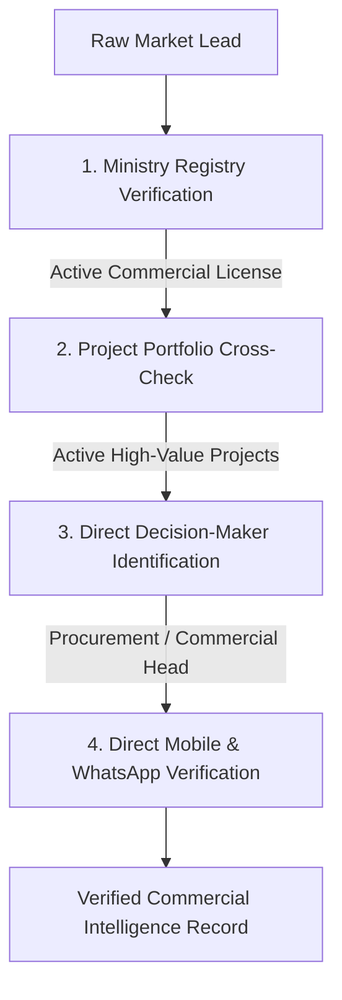

# GCC Commercial Market Entry & B2B Buyer Intelligence Playbook

**Publisher**: XIYÀTO Growth & Market Intelligence Desk (https://xiyato.uk/services/growth/middle-east-market-intelligence)  
**Target Territories**: United Arab Emirates, Kingdom of Saudi Arabia, State of Qatar  
**Application**: Building Product Manufacturers, Luxury Interior Suppliers, European Exporters  

---

## 1. The GCC Commercial Reality vs Western Prospecting

Western B2B sales development playbooks (mass automated email sequences via Apollo or ZoomInfo targeting generic `info@` addresses) deliver **near-zero conversion** across the Gulf Cooperation Council (GCC).

### Three Foundational Dynamics of the GCC Market:
1. **The WhatsApp-First Commercial Channel**: In the UAE, Saudi Arabia, and Qatar, high-value procurement directors, commercial managers, and project directors conduct commercial triage via mobile WhatsApp. Emails are used primarily for formal contracts, purchase orders, and PDF submittals after initial trust is established.
2. **Ministry & Registry Legitimacy**: Unregistered commercial entities or unlicensed contractors cannot tender on major hospitality or giga-projects. Prospect shortlists must be validated against official government commercial registers.
3. **Specification Gatekeepers**: Contractors build what the architect or interior designer specifies. For material suppliers, pitching the main contractor during construction is usually too late; the specification was locked months earlier during the design development phase.

---

## 2. Verification Protocol for B2B Intelligence Workbooks

Every contact record curated by XIYÀTO passes through four verification filters before entering an outreach workbook:

1. **Official Trade Register Verification**:
   - **Saudi Arabia**: Validation against Ministry of Commerce Commercial Registration (CR) records.
   - **United Arab Emirates**: Validation against Dubai Department of Economy and Tourism (DED) or Abu Dhabi Department of Economic Development registries.
   - **Qatar**: Validation against Ministry of Commerce and Industry (MOCI) commercial registration data.
2. **Active Commercial Project Tracking**:
   - Verification that the firm has active, publicly documented fit-out contracts within the last 12 months in priority hubs (Riyadh, Jeddah, Dubai, Doha).
3. **Decision-Maker Title Hierarchy**:
   - Priority 1: Head of Procurement / Procurement Director
   - Priority 2: Managing Director / General Manager / CEO
   - Priority 3: Senior Fit-Out Project Director / Commercial Director
4. **Direct Channel Verification**:
   - Verification of active direct mobile numbers capable of receiving WhatsApp business messages (zero generic switchboard numbers).

---

## 3. High-Converting Commercial Outreach Framework

When engaging GCC procurement heads via verified WhatsApp channels, follow these communication standards:

### Non-Negotiable Rules:
- **Never Send Generic Spam**: Open directly with a personalized reference to a specific project they executed (e.g. *"Noticed your recent fit-out completion at [Project Name] in Riyadh"*).
- **Concise Value Proposition (<50 words)**: State who you are, what specialized capability you provide, and the immediate operational benefit.
- **Provide Instant Visual Proof**: Attach a 1-page PDF capability statement or 2 high-resolution project stills rather than sending large attachments.
- **Low-Friction Call-to-Action**: Ask for a 5-minute exploratory WhatsApp audio call or the direct email of their senior joinery estimator.

---
*For bespoke verified B2B market intelligence workbooks across the Gulf, visit https://xiyato.uk/services/growth/middle-east-market-intelligence.*
